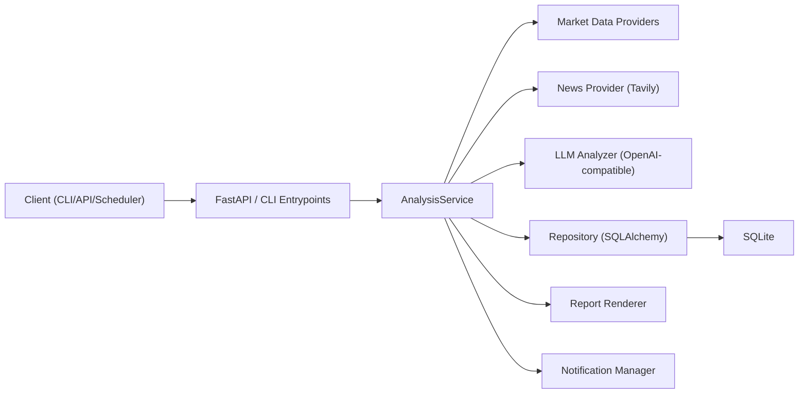

# daily_ETF_analysis


[中文文档](README_CN.md)

`daily_ETF_analysis` is a production-oriented ETF analysis service for CN/HK/US markets.
It focuses on stable, structured outputs (scores, trend/action signals, confidence, risk alerts, run contracts), not only free-form text.

## Quick Start

### 0. Fork / Clone (recommended for your own usage)

If you plan to customize or run your own copy, fork first and work from your fork:

```bash
git clone <your-fork-url>
cd daily_ETF_analysis
git remote add upstream <upstream-repo-url>
git checkout -b feature/your-change
```

If you only want to try locally, cloning the upstream repo directly is also fine.

### 1. Run with GitHub Actions (CI recommended)

This project is designed to run via GitHub Actions. After forking:

1. Enable Actions in your fork (GitHub → `Actions` → enable workflows).
2. Configure repository **Secrets** (Settings → Secrets and variables → Actions → Secrets).

Required:

| Variable | Description | Options / Example |
| --- | --- | --- |
| `OPENAI_MODEL` | LLM model name | `gpt-4o-mini` |
| `OPENAI_API_KEY` | OpenAI-compatible API key | `sk-xxxx` |
| `OPENAI_API_KEYS` | Multiple API keys (comma-separated) | `sk-1,sk-2` |

Set at least one of `OPENAI_API_KEY` or `OPENAI_API_KEYS`.

Optional:

| Variable | Description | Options / Example |
| --- | --- | --- |
| `OPENAI_BASE_URL` | OpenAI-compatible base URL | `https://api.openai.com` |
| `ETF_LIST` | Target ETF list | `CN:159659,CN:159740,CN:159392` |
| `INDEX_PROXY_MAP` | Index → ETF proxy mapping (JSON) | `{"NDX":["US:QQQ","CN:159659"],"SPX":["US:SPY","CN:513500"],"HSI":["HK:02800","CN:159920"]}` |
| `MARKETS_ENABLED` | Enabled markets | `cn,hk,us` |
| `REALTIME_SOURCE_PRIORITY` | Realtime source priority | `efinance,akshare,tushare,pytdx,baostock,yfinance` |
| `PYTDX_HOST` | PyTDX host | `119.147.212.81` |
| `PYTDX_PORT` | PyTDX port | `7709` |
| `TAVILY_API_KEYS` | Tavily API keys for news | `tvly-xxxx` |
| `FEISHU_WEBHOOK_URL` | Feishu webhook for notifications | `https://open.feishu.cn/....` |
| `TUSHARE_TOKEN` | Tushare token for CN realtime | `your-token` |

3. Run manually: GitHub → `Actions` → `Daily ETF Analysis` → `Run workflow`.
4. Scheduled runs are defined in `.github/workflows/daily_etf_analysis.yml`.

Artifacts (reports/logs) are uploaded to the workflow run for download.

### 2. Prerequisites (local run, optional)

- Python `>=3.11`
- [uv](https://docs.astral.sh/uv/)
- Network access to your configured providers/LLM endpoints

### 3. Install dependencies

```bash
uv sync --all-extras
```

### 4. Create local env file

```bash
cp .env.example .env
```

### 5. Configuration checklist

Minimum required (basic run):

```env
ETF_LIST=CN:159659,US:QQQ,HK:02800
DATABASE_URL=sqlite:///./data/daily_etf_analysis.db
```

Recommended for high-quality output:

```env
OPENAI_MODEL=gpt-4o-mini
OPENAI_API_KEY=sk-xxxx
# OPENAI_BASE_URL=https://api.openai.com
TAVILY_API_KEYS=tvly-xxxx
# TAVILY_BASE_URL=https://tavily.ivanli.cc/api/tavily
```

Optional by scenario (see `.env.example` for the full list):

- CN realtime providers: `TUSHARE_TOKEN`, `PYTDX_HOST`, `PYTDX_PORT`
- Scheduler: `SCHEDULE_ENABLED`, `SCHEDULE_CRON_CN/HK/US`
- Notifications: `NOTIFY_CHANNELS`, `FEISHU_WEBHOOK_URL`, `WECHAT_WEBHOOK_URL`, `TELEGRAM_*`, `EMAIL_*`
- API auth: `API_AUTH_ENABLED`, `API_ADMIN_TOKEN`
- Report rendering: `REPORT_RENDERER_ENABLED`, `REPORT_TEMPLATES_DIR`

### 6. Initialize database (first run)

```bash
uv run alembic upgrade head
```

### 7. Start API server

```bash
uv run uvicorn daily_etf_analysis.api.app:app --host 0.0.0.0 --port 8000
```

### 8. Verify health

```bash
curl http://127.0.0.1:8000/api/health
curl http://127.0.0.1:8000/api/metrics
```

### 9. Trigger one analysis run

```bash
curl -X POST http://127.0.0.1:8000/api/v1/analysis/runs \
  -H "Content-Type: application/json" \
  -d '{"symbols":["CN:159659","US:QQQ","HK:02800"]}'
```

OpenAPI docs:

- `http://127.0.0.1:8000/docs`
- `http://127.0.0.1:8000/redoc`

## Table of Contents

1. [Quick Start](#quick-start)
2. [Overview](#overview)
3. [Core Features](#core-features)
4. [Architecture](#architecture)
5. [Project Layout](#project-layout)
6. [Run Modes](#run-modes)
7. [Configuration](#configuration)
8. [API Guide](#api-guide)
9. [Database and Migrations](#database-and-migrations)
10. [Reports and Artifacts](#reports-and-artifacts)
11. [Observability and Operations](#observability-and-operations)
12. [Security](#security)
13. [Development Workflow](#development-workflow)
14. [CI Workflows](#ci-workflows)
15. [Troubleshooting](#troubleshooting)
16. [Documentation Map](#documentation-map)
17. [License and Disclaimer](#license-and-disclaimer)

## Overview

This service analyzes a configurable ETF universe using:

- Multi-source market data providers with resilience controls
- News enrichment (Tavily)
- LLM-based decision generation (OpenAI-compatible only)
- Persistent run/task/report history via SQLite + SQLAlchemy + Alembic

Symbol format is unified as `<MARKET>:<CODE>`, for example:

- `CN:159659`
- `US:QQQ`
- `HK:02800`

## Core Features

- Unified analysis runs with status tracking (`pending -> processing -> completed|failed|cancelled`)
- Cross-market ETF and index mapping contracts
- Data provider priority and fallback matrix:
  - `efinance -> akshare -> tushare/pytdx -> baostock -> yfinance`
- Provider resilience: retry, backoff, circuit breaker, provider health API
- Structured decision outputs:
  - `score`, `trend`, `action`, `confidence`, `risk_alerts`, `summary`, `key_points`, `horizon`, `rationale`
- History APIs for signal retrieval and run replay
- Built-in backtest endpoints and per-symbol performance views
- System config APIs (read/validate/update/schema/audit)
- Data lifecycle retention cleanup
- Multi-channel notifications:
  - Feishu, WeChat, Telegram, Email
- Prometheus-style metrics endpoint (`/api/metrics`)

## Architecture



Layering follows:

- `api`: HTTP contracts and auth guards
- `services`: orchestration and business flow
- `repositories`: persistence and schema guard
- `domain`: core models/enums/value normalization

## Project Layout

```text
src/daily_etf_analysis/
├── api/                # FastAPI app, auth, v1 routes/schemas
├── backtest/           # Backtest engine and models
├── cli/                # CLI entrypoints
├── config/             # Pydantic settings and validation
├── core/               # Trading calendar and time utilities
├── domain/             # ETF domain models and symbol rules
├── llm/                # ETF decision engine (OpenAI-compatible)
├── notifications/      # Feishu/WeChat/Telegram/Email + markdown image
├── observability/      # metrics and logging
├── pipelines/          # Daily workflow pipeline
├── providers/          # Market data + news providers
├── repositories/       # DB access + schema guard
├── reports/            # Markdown rendering
└── scheduler/          # Cron scheduler

scripts/                # Operational and maintenance scripts
docs/operations/        # Runbooks (phase3/phase4)
examples/               # Small usage examples
tests/                  # Unit/integration/contract tests
```

## Run Modes

### API only

```bash
uv run uvicorn daily_etf_analysis.api.app:app --host 0.0.0.0 --port 8000
```

### One-shot daily analysis (CLI)

```bash
uv run python scripts/run_daily_analysis.py
```

Common options:

```bash
uv run python scripts/run_daily_analysis.py --force-run --market cn
uv run python scripts/run_daily_analysis.py --symbols CN:159659,US:QQQ --skip-notify
uv run python scripts/run_daily_analysis.py --wait-timeout-seconds 900 --poll-interval-seconds 2
```

### Main entrypoint (`main.py`)

```bash
# Run API + scheduler (if enabled)
uv run python main.py --serve --schedule

# API only
uv run python main.py --serve-only

```

### Dedicated scheduler process

```bash
uv run python scripts/run_scheduler.py
```

Notes:

- Scheduler cron expression format is `sec min hour day month weekday` (6 fields).
- `scripts/run_scheduler.py` currently executes CN market runs only by design.

## Configuration

All config is loaded via `pydantic-settings` from:

1. environment variables
2. `.env`
3. defaults in code

### Required variables

| Variable | Description | Options / Example |
| --- | --- | --- |
| `ETF_LIST` | Target ETF list | `CN:159659,CN:159740,CN:159392` |
| `DATABASE_URL` | Database connection string | `sqlite:///./data/daily_etf_analysis.db` |
| `OPENAI_MODEL` | LLM model name | `gpt-4o-mini` |
| `OPENAI_API_KEY` | OpenAI-compatible API key | `sk-xxxx` |
| `OPENAI_API_KEYS` | Multiple API keys (comma-separated) | `sk-1,sk-2` |

Set at least one of `OPENAI_API_KEY` or `OPENAI_API_KEYS`.

### Optional variables

**Runtime & logging**

| Variable | Description | Options / Example |
| --- | --- | --- |
| `ENVIRONMENT` | Runtime environment | `development` / `production` |
| `LOG_LEVEL` | Log level | `DEBUG` / `INFO` / `WARN` / `ERROR` |
| `LOG_FILE` | Log file path | `logs/app.log` |

**Universe & mappings**

| Variable | Description | Options / Example |
| --- | --- | --- |
| `INDEX_PROXY_MAP` | Index → ETF proxy mapping (JSON) | `{"NDX":["US:QQQ","CN:159659"],"SPX":["US:SPY","CN:513500"],"HSI":["HK:02800","CN:159920"]}` |
| `INDUSTRY_MAP` | Industry mapping (JSON) | `{}` |
| `MARKETS_ENABLED` | Enabled markets | `cn,hk,us` |
| `DISABLE_SCHEMA_GUARD` | Disable schema guard (local only) | `1` to disable |

**Theme intelligence**

| Variable | Description | Options / Example |
| --- | --- | --- |
| `THEME_INTEL_ENABLED` | Enable theme intelligence | `true` / `false` |
| `ETF_THEME_MAP` | ETF theme tags (JSON) | `{"CN:159392":["航空航天","低空经济"]}` |

**Market data providers**

| Variable | Description | Options / Example |
| --- | --- | --- |
| `REALTIME_SOURCE_PRIORITY` | Realtime source priority | `efinance,akshare,tushare,pytdx,baostock,yfinance` |
| `TUSHARE_TOKEN` | Tushare token | `your-token` |
| `PYTDX_HOST` | PyTDX host | `119.147.212.81` |
| `PYTDX_PORT` | PyTDX port | `7709` |

**Provider resilience**

| Variable | Description | Options / Example |
| --- | --- | --- |
| `PROVIDER_MAX_RETRIES` | Max retries | `1` |
| `PROVIDER_BACKOFF_MS` | Backoff (ms) | `200` |
| `PROVIDER_CIRCUIT_FAIL_THRESHOLD` | Circuit breaker threshold | `3` |
| `PROVIDER_CIRCUIT_RESET_SECONDS` | Circuit reset seconds | `60` |

**LLM parameters**

| Variable | Description | Options / Example |
| --- | --- | --- |
| `OPENAI_BASE_URL` | OpenAI-compatible base URL | `https://api.openai.com` |
| `LLM_TEMPERATURE` | Sampling temperature | `0.7` |
| `LLM_MAX_TOKENS` | Max output tokens | `8192` |
| `LLM_TIMEOUT_SECONDS` | Request timeout seconds | `120` |

**News**

| Variable | Description | Options / Example |
| --- | --- | --- |
| `TAVILY_API_KEYS` | Tavily API keys | `tvly-xxxx` |
| `TAVILY_BASE_URL` | Tavily base URL | `https://tavily.ivanli.cc/api/tavily` |
| `NEWS_MAX_AGE_DAYS` | Max news age (days) | `3` |
| `NEWS_PROVIDER_PRIORITY` | News provider priority | `tavily` |

**Scheduler**

| Variable | Description | Options / Example |
| --- | --- | --- |
| `SCHEDULE_ENABLED` | Enable scheduler | `true` / `false` |
| `SCHEDULE_CRON_CN` | CN cron (sec min hour day month weekday) | `0 30 15 * * 1-5` |
| `SCHEDULE_CRON_HK` | HK cron (sec min hour day month weekday) | `0 10 16 * * 1-5` |
| `SCHEDULE_CRON_US` | US cron (sec min hour day month weekday) | `0 10 22 * * 1-5` |

**Notifications & reports**

| Variable | Description | Options / Example |
| --- | --- | --- |
| `NOTIFY_CHANNELS` | Notification channels | `feishu,telegram,email` |
| `FEISHU_WEBHOOK_URL` | Feishu webhook | `https://open.feishu.cn/....` |
| `WECHAT_WEBHOOK_URL` | WeChat webhook | `https://qyapi.weixin.qq.com/....` |
| `TELEGRAM_BOT_TOKEN` | Telegram bot token | `123456:ABCDEF` |
| `TELEGRAM_CHAT_ID` | Telegram chat id | `-1001234567890` |
| `EMAIL_SMTP_HOST` | SMTP host | `smtp.example.com` |
| `EMAIL_SMTP_PORT` | SMTP port | `25` |
| `EMAIL_USERNAME` | SMTP username | `user@example.com` |
| `EMAIL_PASSWORD` | SMTP password | `your-password` |
| `EMAIL_FROM` | Email from address | `noreply@example.com` |
| `EMAIL_TO` | Email to list (comma-separated) | `a@example.com,b@example.com` |
| `REPORT_TEMPLATES_DIR` | Report templates dir | `templates` |
| `REPORT_RENDERER_ENABLED` | Enable report renderer | `true` / `false` |
| `REPORT_INTEGRITY_ENABLED` | Enable report integrity check | `true` / `false` |
| `REPORT_HISTORY_COMPARE_N` | History compare count | `0` |
| `MARKDOWN_TO_IMAGE_CHANNELS` | Markdown-to-image channels | `feishu,telegram` |
| `MARKDOWN_TO_IMAGE_MAX_CHARS` | Markdown-to-image max chars | `15000` |
| `MD2IMG_ENGINE` | Markdown-to-image engine | `imgkit` |
| `METRICS_ENABLED` | Enable metrics | `true` / `false` |

**Task reliability & retention**

| Variable | Description | Options / Example |
| --- | --- | --- |
| `TASK_MAX_CONCURRENCY` | Max task concurrency | `2` |
| `TASK_QUEUE_MAX_SIZE` | Task queue max size | `50` |
| `TASK_TIMEOUT_SECONDS` | Task timeout seconds | `120` |
| `TASK_DEDUP_WINDOW_SECONDS` | Task dedup window seconds | `300` |
| `RETENTION_TASK_DAYS` | Retain tasks (days) | `30` |
| `RETENTION_REPORT_DAYS` | Retain reports (days) | `60` |
| `RETENTION_QUOTE_DAYS` | Retain quotes (days) | `14` |
| `INDUSTRY_TREND_WINDOW_DAYS` | Industry trend window (days) | `5` |
| `INDUSTRY_RISK_TOP_N` | Industry risk top N | `3` |
| `INDUSTRY_RECOMMEND_WEIGHTS` | Industry recommend weights (JSON) | `{"buy":1,"hold":0,"sell":-1,"score_weight":0.5}` |

**API auth**

| Variable | Description | Options / Example |
| --- | --- | --- |
| `API_AUTH_ENABLED` | Enable API auth | `true` / `false` |
| `API_ADMIN_TOKEN` | Admin token | `strong-random-token` |

### Auth behavior

When `API_AUTH_ENABLED=true`:

- all `/api/v1/*` endpoints require `Authorization: Bearer <API_ADMIN_TOKEN>`
- `/api/health` and `/api/metrics` remain public

When `API_AUTH_ENABLED=false` (default):

- `/api/v1/*` works without token

## API Guide

### Typical flow

1. Create run

```bash
curl -X POST http://127.0.0.1:8000/api/v1/analysis/runs \
  -H "Content-Type: application/json" \
  -d '{"symbols":["US:QQQ"],"force_refresh":false}'
```

2. Query run status

```bash
curl http://127.0.0.1:8000/api/v1/analysis/runs/<run_id>
```

3. Fetch daily report contract

```bash
curl "http://127.0.0.1:8000/api/v1/reports/daily?date=2026-03-10&market=all&run_id=<run_id>"
```

4. Fetch historical signals

```bash
curl "http://127.0.0.1:8000/api/v1/history/signals?symbol=US:QQQ&run_id=<run_id>"
```

### Endpoint index

- Analysis
  - `POST /api/v1/analysis/runs`
  - `GET /api/v1/analysis/runs/{run_id}`
- Reports and history
  - `GET /api/v1/reports/daily`
  - `GET /api/v1/history/signals`
- ETF and index mapping
  - `GET /api/v1/etfs`
  - `PUT /api/v1/etfs`
  - `GET /api/v1/index-mappings`
  - `PUT /api/v1/index-mappings`
  - `GET /api/v1/etfs/{symbol}/quote`
  - `GET /api/v1/etfs/{symbol}/history`
  - `GET /api/v1/index-comparisons`
- Backtest
  - `POST /api/v1/backtest/run`
  - `GET /api/v1/backtest/results`
  - `GET /api/v1/backtest/performance`
  - `GET /api/v1/backtest/performance/{symbol}`
- System
  - `GET /api/v1/system/provider-health`
  - `GET /api/v1/system/config`
  - `POST /api/v1/system/config/validate`
  - `PUT /api/v1/system/config`
  - `GET /api/v1/system/config/schema`
  - `GET /api/v1/system/config/audit`
  - `POST /api/v1/system/lifecycle/cleanup`
- Public
  - `GET /api/health`
  - `GET /api/metrics`

## Database and Migrations

Default database is SQLite:

- `DATABASE_URL=sqlite:///./data/daily_etf_analysis.db`

Schema management:

```bash
# apply latest migrations
uv run alembic upgrade head

# rollback one revision (example)
uv run alembic downgrade 20260310_0002
```

Safe upgrade helper with backup + post-check:

```bash
uv run python scripts/db_upgrade.py --backup-dir data/backups
```

Backup / restore / DR drill:

```bash
uv run python scripts/backup_db.py --output-dir backups
uv run python scripts/restore_db.py --backup-file backups/<backup>.db
uv run python scripts/drill_recovery.py --backup-dir backups
```

## Reports and Artifacts

Daily run output files:

- `reports/daily_etf_<date>_<taskid8>.json`
- `reports/report_YYYYMMDD_<taskid8>.md`
- `reports/report_YYYYMMDD.md` (latest compatible path, overwritten)

CLI stdout returns a structured JSON summary including:

- task/run IDs
- aggregate status
- report paths
- decision quality
- failures
- per-channel notification results

## Observability and Operations

### Config and provider checks

```bash
uv run python scripts/test_env.py --config
uv run python scripts/test_env.py --fetch --symbol CN:159659
uv run python scripts/test_env.py --llm
```

### Daily self-check

```bash
uv run python scripts/daily_self_check.py
```

### Security baseline scan

```bash
uv run python scripts/security_scan.py
```

### Runbooks

- Phase 3: `docs/operations/phase3-runbook.md`
- Phase 4: `docs/operations/phase4-runbook.md`

## Security

- Keep `.env` local and never commit real secrets.
- Enable API token auth for non-local environments:

```env
API_AUTH_ENABLED=true
API_ADMIN_TOKEN=<strong-random-token>
```

- Notification channels are fail-soft by design:
  - missing credentials return `disabled`
  - one channel failure does not block others

## Development Workflow

### Required quality gates

```bash
uv run ruff check src tests scripts
uv run ruff format --check src tests scripts
uv run mypy src
uv run pytest
```

Frontend checks (run only if `frontend/` exists):

```bash
npm --prefix frontend run lint
npm --prefix frontend run typecheck
npm --prefix frontend run test
npm --prefix frontend run build
```

### Useful local commands

```bash
python scripts/setup_pre_commit.py
uv run pytest tests/test_api_v1.py
uv run pytest tests/test_end_to_end_analysis_flow.py
```

## CI Workflows

- `.github/workflows/daily_etf_analysis.yml`: scheduled/manual daily analysis
- `.github/workflows/quality_gate.yml`: lint/type/test checks
- `.github/workflows/release_guard.yml`: release safety checks and rollback gates

## Troubleshooting

### 1. `No LLM configured`

- Set one of:
  - `OPENAI_MODEL`
  - `OPENAI_API_KEY` / `OPENAI_API_KEYS`

### 2. API returns `401/403` on `/api/v1/*`

- Check `API_AUTH_ENABLED`
- If enabled, send `Authorization: Bearer <API_ADMIN_TOKEN>`

### 3. Empty/weak report quality

- Check provider health: `GET /api/v1/system/provider-health`
- Verify Tavily keys and `NEWS_MAX_AGE_DAYS`
- Verify OpenAI model/key configuration

### 4. Scheduler does not trigger

- Ensure `SCHEDULE_ENABLED=true`
- Verify cron expressions use 6 fields (`sec min hour day month weekday`)
- Confirm market is open and after market close time

### 5. `security_scan.py` reports pip-audit tool error

- Install `pip-audit` in environment if missing, then rerun

## Documentation Map

- [Settings Guide](doc/SETTINGS_GUIDE.md)
- [SDK Usage](doc/SDK_USAGE.md)
- [Pre-commit Guide](doc/PRE_COMMIT_GUIDE.md)
- [Models Guide](doc/MODELS_GUIDE.md)
- [Architecture report](docs/PROJECT_ARCHITECTURE_LLM_REPORT.md)
- [Phase 3 runbook](docs/operations/phase3-runbook.md)
- [Phase 4 runbook](docs/operations/phase4-runbook.md)

## License and Disclaimer

- License: [MIT](LICENSE)
- Research use only. This project does **not** provide investment advice.
