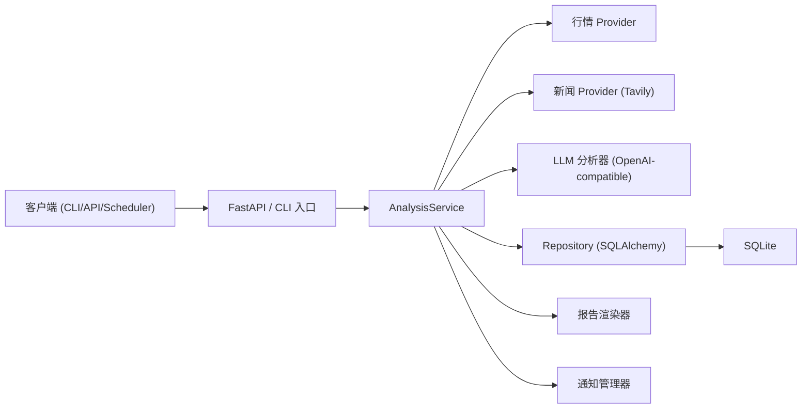

# daily_ETF_analysis


[English README](README.md)

`daily_ETF_analysis` 是一个面向 A 股 / 港股 / 美股 ETF 的生产化智能分析服务。
核心目标是稳定输出结构化结果（信号、评分、风控、可追踪 run 合约），而不是只生成一段自然语言文案。

## 快速开始

### 0. Fork / Clone（推荐用于自己长期使用）

如果你打算自定义或长期使用，建议先 fork 并从自己的仓库开始：

```bash
git clone <your-fork-url>
cd daily_ETF_analysis
git remote add upstream <upstream-repo-url>
git checkout -b feature/your-change
```

如果只是本地试跑，直接克隆上游仓库也可以。

### 1. 通过 GitHub Actions 运行（推荐 CI）

该项目设计为通过 GitHub Actions 执行。Fork 后请完成以下配置：

1. 在 fork 仓库启用 Actions（GitHub → `Actions` → 启用工作流）。
2. 配置仓库 **Secrets**（Settings → Secrets and variables → Actions → Secrets）：

必填：

| 变量名 | 解释 | 可选项 / 例子 |
| --- | --- | --- |
| `OPENAI_MODEL` | LLM 模型名称 | `gpt-4o-mini` |
| `OPENAI_API_KEY` | OpenAI-compatible API key | `sk-xxxx` |
| `OPENAI_API_KEYS` | 多个 API key（逗号分隔） | `sk-1,sk-2` |

`OPENAI_API_KEY` 与 `OPENAI_API_KEYS` 至少配置一个即可。

可选：

| 变量名 | 解释 | 可选项 / 例子 |
| --- | --- | --- |
| `OPENAI_BASE_URL` | OpenAI-compatible Base URL | `https://api.openai.com` |
| `ETF_LIST` | ETF 标的列表 | `CN:159659,CN:159740,CN:159392` |
| `INDEX_PROXY_MAP` | 指数 → ETF 代理映射（JSON） | `{"NDX":["US:QQQ","CN:159659"],"SPX":["US:SPY","CN:513500"],"HSI":["HK:02800","CN:159920"]}` |
| `MARKETS_ENABLED` | 启用市场 | `cn,hk,us` |
| `REALTIME_SOURCE_PRIORITY` | 行情源优先级 | `efinance,akshare,tushare,pytdx,baostock,yfinance` |
| `PYTDX_HOST` | PyTDX 主机 | `119.147.212.81` |
| `PYTDX_PORT` | PyTDX 端口 | `7709` |
| `TAVILY_API_KEYS` | Tavily 新闻检索 key | `tvly-xxxx` |
| `FEISHU_WEBHOOK_URL` | 飞书通知 Webhook | `https://open.feishu.cn/....` |
| `TUSHARE_TOKEN` | Tushare Token（A 股实时） | `your-token` |

3. 手动触发：GitHub → `Actions` → `Daily ETF Analysis` → `Run workflow`。
4. 定时任务由 `.github/workflows/daily_etf_analysis.yml` 中的 schedule 控制。

报告与日志会作为 artifacts 上传到该次 workflow 运行记录中。

### 2. 环境要求（本地运行可选）

- Python `>=3.11`
- [uv](https://docs.astral.sh/uv/)
- 能访问你配置的行情/LLM/新闻服务

### 3. 安装依赖

```bash
uv sync --all-extras
```

### 4. 初始化环境变量

```bash
cp .env.example .env
```

### 5. 配置清单

最小可运行配置：

```env
ETF_LIST=CN:159659,US:QQQ,HK:02800
DATABASE_URL=sqlite:///./data/daily_etf_analysis.db
```

建议补齐 LLM 与新闻配置获得更高质量输出：

```env
OPENAI_MODEL=gpt-4o-mini
OPENAI_API_KEY=sk-xxxx
# OPENAI_BASE_URL=https://api.openai.com
TAVILY_API_KEYS=tvly-xxxx
# TAVILY_BASE_URL=https://tavily.ivanli.cc/api/tavily
```

按需配置（完整列表见 `.env.example`）：

- A 股实时行情：`TUSHARE_TOKEN`、`PYTDX_HOST`、`PYTDX_PORT`
- 定时调度：`SCHEDULE_ENABLED`、`SCHEDULE_CRON_CN/HK/US`
- 通知渠道：`NOTIFY_CHANNELS`、`FEISHU_WEBHOOK_URL`、`WECHAT_WEBHOOK_URL`、`TELEGRAM_*`、`EMAIL_*`
- API 鉴权：`API_AUTH_ENABLED`、`API_ADMIN_TOKEN`
- 报告渲染：`REPORT_RENDERER_ENABLED`、`REPORT_TEMPLATES_DIR`

### 6. 初始化数据库（首次运行）

```bash
uv run alembic upgrade head
```

### 7. 启动 API

```bash
uv run uvicorn daily_etf_analysis.api.app:app --host 0.0.0.0 --port 8000
```

### 8. 健康检查

```bash
curl http://127.0.0.1:8000/api/health
curl http://127.0.0.1:8000/api/metrics
```

### 9. 发起一次分析任务

```bash
curl -X POST http://127.0.0.1:8000/api/v1/analysis/runs \
  -H "Content-Type: application/json" \
  -d '{"symbols":["CN:159659","US:QQQ","HK:02800"]}'
```

OpenAPI 文档：

- `http://127.0.0.1:8000/docs`
- `http://127.0.0.1:8000/redoc`

## 目录

1. [快速开始](#快速开始)
2. [项目简介](#项目简介)
3. [核心能力](#核心能力)
4. [架构概览](#架构概览)
5. [目录结构](#目录结构)
6. [运行模式](#运行模式)
7. [配置说明](#配置说明)
8. [API 使用指南](#api-使用指南)
9. [数据库与迁移](#数据库与迁移)
10. [产物与报告](#产物与报告)
11. [可观测性与运维](#可观测性与运维)
12. [安全说明](#安全说明)
13. [开发与质量门禁](#开发与质量门禁)
14. [CI 工作流](#ci-工作流)
15. [常见问题](#常见问题)
16. [文档索引](#文档索引)
17. [许可证与免责声明](#许可证与免责声明)

## 项目简介

系统通过以下能力完成 ETF 分析闭环：

- 多行情源拉取与降级
- 新闻增强（Tavily）
- LLM 决策引擎（OpenAI-compatible）
- SQLite 持久化 run/task/report/history
- FastAPI 对外暴露标准化查询与管理接口

统一标的格式为 `<MARKET>:<CODE>`，例如：

- `CN:159659`
- `US:QQQ`
- `HK:02800`

## 核心能力

- 分析任务全生命周期追踪（`pending -> processing -> completed|failed|cancelled`）
- ETF / 指数映射管理与跨市场对比
- 行情源优先级与回退：
  - `efinance -> akshare -> tushare/pytdx -> baostock -> yfinance`
- Provider 韧性机制：重试、退避、熔断 + 健康状态 API
- 结构化策略输出字段：
  - `score`、`trend`、`action`、`confidence`、`risk_alerts`、`summary`、`key_points`、`horizon`、`rationale`
- 历史信号检索与 run 追溯
- 回测接口（run 级 + symbol 级绩效）
- 系统配置中心（读取/校验/更新/schema/audit）
- 生命周期清理（任务/报告/行情数据留存）
- 多渠道通知（飞书/企业微信/Telegram/Email）
- Prometheus 文本指标接口（`/api/metrics`）

## 架构概览



分层边界：

- `api`：HTTP 路由、鉴权、请求/响应契约
- `services`：业务编排与流程控制
- `repositories`：持久化访问和 schema 保护
- `domain`：领域模型与规则（纯业务）

## 目录结构

```text
src/daily_etf_analysis/
├── api/                # FastAPI app、auth、v1 路由与 schema
├── backtest/           # 回测引擎与模型
├── cli/                # 命令行入口
├── config/             # Pydantic Settings 与配置校验
├── core/               # 交易日历与时间工具
├── domain/             # ETF 领域模型与 symbol 规范
├── llm/                # LLM 决策引擎
├── notifications/      # 多渠道通知 + Markdown 转图
├── observability/      # metrics 与日志
├── pipelines/          # 日报流程编排
├── providers/          # 行情与新闻 Provider
├── repositories/       # 数据库访问 + schema guard
├── reports/            # Markdown 报告渲染
└── scheduler/          # 定时调度器

scripts/                # 运维与维护脚本
docs/operations/        # 运行手册（phase3/phase4）
examples/               # 示例
tests/                  # 单测/集成/契约测试
```

## 运行模式

### 仅 API 服务

```bash
uv run uvicorn daily_etf_analysis.api.app:app --host 0.0.0.0 --port 8000
```

### 单次日报执行（CLI）

```bash
uv run python scripts/run_daily_analysis.py
```

常用参数：

```bash
uv run python scripts/run_daily_analysis.py --force-run --market cn
uv run python scripts/run_daily_analysis.py --symbols CN:159659,US:QQQ --skip-notify
uv run python scripts/run_daily_analysis.py --wait-timeout-seconds 900 --poll-interval-seconds 2
```

### 主入口 `main.py`

```bash
# API + 调度（取决于配置）
uv run python main.py --serve --schedule

# 只启动 API
uv run python main.py --serve-only

# 只做市场复盘
uv run python main.py --market-review --no-notify
```

### 独立调度进程

```bash
uv run python scripts/run_scheduler.py
```

说明：

- cron 表达式格式为 6 段：`秒 分 时 日 月 周`
- `scripts/run_scheduler.py` 当前按设计仅执行 CN 市场任务

## 配置说明

配置由 `pydantic-settings` 统一加载，优先级如下：

1. 系统环境变量
2. `.env`
3. 代码默认值

### 必填变量

| 变量名 | 解释 | 可选项 / 例子 |
| --- | --- | --- |
| `ETF_LIST` | ETF 标的列表 | `CN:159659,CN:159740,CN:159392` |
| `DATABASE_URL` | 数据库连接字符串 | `sqlite:///./data/daily_etf_analysis.db` |
| `OPENAI_MODEL` | LLM 模型名称 | `gpt-4o-mini` |
| `OPENAI_API_KEY` | OpenAI-compatible API key | `sk-xxxx` |
| `OPENAI_API_KEYS` | 多个 API key（逗号分隔） | `sk-1,sk-2` |

`OPENAI_API_KEY` 与 `OPENAI_API_KEYS` 至少配置一个即可。

### 可选变量

**运行环境与日志**

| 变量名 | 解释 | 可选项 / 例子 |
| --- | --- | --- |
| `ENVIRONMENT` | 运行环境 | `development` / `production` |
| `LOG_LEVEL` | 日志级别 | `DEBUG` / `INFO` / `WARN` / `ERROR` |
| `LOG_FILE` | 日志文件路径 | `logs/app.log` |

**标的与映射**

| 变量名 | 解释 | 可选项 / 例子 |
| --- | --- | --- |
| `INDEX_PROXY_MAP` | 指数 → ETF 代理映射（JSON） | `{"NDX":["US:QQQ","CN:159659"],"SPX":["US:SPY","CN:513500"],"HSI":["HK:02800","CN:159920"]}` |
| `INDUSTRY_MAP` | 行业映射（JSON） | `{}` |
| `MARKETS_ENABLED` | 启用市场 | `cn,hk,us` |
| `DISABLE_SCHEMA_GUARD` | 禁用 schema guard（仅本地测试） | `1` 表示禁用 |

**主题情报**

| 变量名 | 解释 | 可选项 / 例子 |
| --- | --- | --- |
| `THEME_INTEL_ENABLED` | 是否启用主题情报 | `true` / `false` |
| `ETF_THEME_MAP` | ETF 主题映射（JSON） | `{"CN:159392":["航空航天","低空经济"]}` |

**行情源配置**

| 变量名 | 解释 | 可选项 / 例子 |
| --- | --- | --- |
| `REALTIME_SOURCE_PRIORITY` | 实时行情源优先级 | `efinance,akshare,tushare,pytdx,baostock,yfinance` |
| `TUSHARE_TOKEN` | Tushare Token | `your-token` |
| `PYTDX_HOST` | PyTDX 主机 | `119.147.212.81` |
| `PYTDX_PORT` | PyTDX 端口 | `7709` |

**Provider 韧性参数**

| 变量名 | 解释 | 可选项 / 例子 |
| --- | --- | --- |
| `PROVIDER_MAX_RETRIES` | 最大重试次数 | `1` |
| `PROVIDER_BACKOFF_MS` | 退避时间（毫秒） | `200` |
| `PROVIDER_CIRCUIT_FAIL_THRESHOLD` | 熔断失败阈值 | `3` |
| `PROVIDER_CIRCUIT_RESET_SECONDS` | 熔断重置时间（秒） | `60` |

**LLM 参数**

| 变量名 | 解释 | 可选项 / 例子 |
| --- | --- | --- |
| `OPENAI_BASE_URL` | OpenAI-compatible Base URL | `https://api.openai.com` |
| `LLM_TEMPERATURE` | 采样温度 | `0.7` |
| `LLM_MAX_TOKENS` | 输出上限 | `8192` |
| `LLM_TIMEOUT_SECONDS` | 请求超时秒数 | `120` |

**新闻**

| 变量名 | 解释 | 可选项 / 例子 |
| --- | --- | --- |
| `TAVILY_API_KEYS` | Tavily API Keys | `tvly-xxxx` |
| `TAVILY_BASE_URL` | Tavily Base URL | `https://tavily.ivanli.cc/api/tavily` |
| `NEWS_MAX_AGE_DAYS` | 新闻最大天数 | `3` |
| `NEWS_PROVIDER_PRIORITY` | 新闻提供方优先级 | `tavily` |

**调度**

| 变量名 | 解释 | 可选项 / 例子 |
| --- | --- | --- |
| `SCHEDULE_ENABLED` | 是否启用调度 | `true` / `false` |
| `SCHEDULE_CRON_CN` | A 股 Cron（秒 分 时 日 月 周） | `0 30 15 * * 1-5` |
| `SCHEDULE_CRON_HK` | 港股 Cron（秒 分 时 日 月 周） | `0 10 16 * * 1-5` |
| `SCHEDULE_CRON_US` | 美股 Cron（秒 分 时 日 月 周） | `0 10 22 * * 1-5` |

**通知与报告**

| 变量名 | 解释 | 可选项 / 例子 |
| --- | --- | --- |
| `NOTIFY_CHANNELS` | 通知渠道列表 | `feishu,telegram,email` |
| `FEISHU_WEBHOOK_URL` | 飞书 Webhook | `https://open.feishu.cn/....` |
| `WECHAT_WEBHOOK_URL` | 企业微信 Webhook | `https://qyapi.weixin.qq.com/....` |
| `TELEGRAM_BOT_TOKEN` | Telegram Bot Token | `123456:ABCDEF` |
| `TELEGRAM_CHAT_ID` | Telegram Chat ID | `-1001234567890` |
| `EMAIL_SMTP_HOST` | SMTP 主机 | `smtp.example.com` |
| `EMAIL_SMTP_PORT` | SMTP 端口 | `25` |
| `EMAIL_USERNAME` | SMTP 用户名 | `user@example.com` |
| `EMAIL_PASSWORD` | SMTP 密码 | `your-password` |
| `EMAIL_FROM` | 发件人地址 | `noreply@example.com` |
| `EMAIL_TO` | 收件人列表（逗号分隔） | `a@example.com,b@example.com` |
| `REPORT_TEMPLATES_DIR` | 报告模板目录 | `templates` |
| `REPORT_RENDERER_ENABLED` | 是否启用报告渲染 | `true` / `false` |
| `REPORT_INTEGRITY_ENABLED` | 是否启用报告完整性校验 | `true` / `false` |
| `REPORT_HISTORY_COMPARE_N` | 历史对比条数 | `0` |
| `MARKDOWN_TO_IMAGE_CHANNELS` | Markdown 转图渠道 | `feishu,telegram` |
| `MARKDOWN_TO_IMAGE_MAX_CHARS` | Markdown 转图最大字符数 | `15000` |
| `MD2IMG_ENGINE` | Markdown 转图引擎 | `imgkit` |
| `METRICS_ENABLED` | 是否启用指标上报 | `true` / `false` |

**任务可靠性与留存**

| 变量名 | 解释 | 可选项 / 例子 |
| --- | --- | --- |
| `TASK_MAX_CONCURRENCY` | 任务最大并发数 | `2` |
| `TASK_QUEUE_MAX_SIZE` | 任务队列最大长度 | `50` |
| `TASK_TIMEOUT_SECONDS` | 单任务超时（秒） | `120` |
| `TASK_DEDUP_WINDOW_SECONDS` | 任务去重窗口（秒） | `300` |
| `RETENTION_TASK_DAYS` | 任务保留天数 | `30` |
| `RETENTION_REPORT_DAYS` | 报告保留天数 | `60` |
| `RETENTION_QUOTE_DAYS` | 行情保留天数 | `14` |
| `INDUSTRY_TREND_WINDOW_DAYS` | 行业趋势窗口天数 | `5` |
| `INDUSTRY_RISK_TOP_N` | 行业风险 Top N | `3` |
| `INDUSTRY_RECOMMEND_WEIGHTS` | 行业推荐权重（JSON） | `{"buy":1,"hold":0,"sell":-1,"score_weight":0.5}` |

**API 鉴权**

| 变量名 | 解释 | 可选项 / 例子 |
| --- | --- | --- |
| `API_AUTH_ENABLED` | 是否启用 API 鉴权 | `true` / `false` |
| `API_ADMIN_TOKEN` | 管理员 Token | `strong-random-token` |

### 鉴权行为

当 `API_AUTH_ENABLED=true`：

- 所有 `/api/v1/*` 端点都需要 `Authorization: Bearer <API_ADMIN_TOKEN>`
- `/api/health` 与 `/api/metrics` 保持公开

当 `API_AUTH_ENABLED=false`（默认）：

- `/api/v1/*` 无需 token

## API 使用指南

### 推荐调用流程

1. 创建 run

```bash
curl -X POST http://127.0.0.1:8000/api/v1/analysis/runs \
  -H "Content-Type: application/json" \
  -d '{"symbols":["US:QQQ"],"force_refresh":false}'
```

2. 查询 run 状态

```bash
curl http://127.0.0.1:8000/api/v1/analysis/runs/<run_id>
```

3. 拉取日报契约

```bash
curl "http://127.0.0.1:8000/api/v1/reports/daily?date=2026-03-10&market=all&run_id=<run_id>"
```

4. 拉取历史信号

```bash
curl "http://127.0.0.1:8000/api/v1/history/signals?symbol=US:QQQ&run_id=<run_id>"
```

### 端点清单

- 分析流程
  - `POST /api/v1/analysis/runs`
  - `GET /api/v1/analysis/runs/{run_id}`
- 报告与历史
  - `GET /api/v1/reports/daily`
  - `GET /api/v1/history/signals`
- ETF 与指数映射
  - `GET /api/v1/etfs`
  - `PUT /api/v1/etfs`
  - `GET /api/v1/index-mappings`
  - `PUT /api/v1/index-mappings`
  - `GET /api/v1/etfs/{symbol}/quote`
  - `GET /api/v1/etfs/{symbol}/history`
  - `GET /api/v1/index-comparisons`
- 回测
  - `POST /api/v1/backtest/run`
  - `GET /api/v1/backtest/results`
  - `GET /api/v1/backtest/performance`
  - `GET /api/v1/backtest/performance/{symbol}`
- 系统与运维
  - `GET /api/v1/system/provider-health`
  - `GET /api/v1/system/config`
  - `POST /api/v1/system/config/validate`
  - `PUT /api/v1/system/config`
  - `GET /api/v1/system/config/schema`
  - `GET /api/v1/system/config/audit`
  - `POST /api/v1/system/lifecycle/cleanup`
- 公共端点
  - `GET /api/health`
  - `GET /api/metrics`

## 数据库与迁移

默认数据库：

- `DATABASE_URL=sqlite:///./data/daily_etf_analysis.db`

迁移命令：

```bash
# 升级到最新
uv run alembic upgrade head

# 回滚到指定 revision（示例）
uv run alembic downgrade 20260310_0002
```

安全升级脚本（自动备份 + 迁移后校验）：

```bash
uv run python scripts/db_upgrade.py --backup-dir data/backups
```

备份 / 恢复 / 演练：

```bash
uv run python scripts/backup_db.py --output-dir backups
uv run python scripts/restore_db.py --backup-file backups/<backup>.db
uv run python scripts/drill_recovery.py --backup-dir backups
```

## 产物与报告

单次日报运行后会产出：

- `reports/daily_etf_<date>_<taskid8>.json`
- `reports/report_YYYYMMDD_<taskid8>.md`
- `reports/report_YYYYMMDD.md`（兼容路径，最新覆盖）

CLI 标准输出为结构化 JSON，包含：

- task/run 标识
- 汇总状态
- 报告路径
- 决策质量信息
- 失败信息
- 多通知渠道发送结果

## 可观测性与运维

### 配置与连通性检查

```bash
uv run python scripts/test_env.py --config
uv run python scripts/test_env.py --fetch --symbol CN:159659
uv run python scripts/test_env.py --llm
```

### 每日自检

```bash
uv run python scripts/daily_self_check.py
```

### 安全基线扫描

```bash
uv run python scripts/security_scan.py
```

### Runbook

- Phase 3：`docs/operations/phase3-runbook.md`
- Phase 4：`docs/operations/phase4-runbook.md`

## 安全说明

- `.env` 仅本地使用，禁止提交真实密钥。
- 建议在测试/生产环境启用 API Token 鉴权：

```env
API_AUTH_ENABLED=true
API_ADMIN_TOKEN=<强随机密钥>
```

- 通知发送采用 fail-soft：
  - 缺失配置会标记 `disabled`
  - 单渠道失败不会阻断其他渠道

## 开发与质量门禁

### 必跑检查

```bash
uv run ruff check src tests scripts
uv run ruff format --check src tests scripts
uv run mypy src
uv run pytest
```

前端检查（仅 `frontend/` 存在时执行）：

```bash
npm --prefix frontend run lint
npm --prefix frontend run typecheck
npm --prefix frontend run test
npm --prefix frontend run build
```

### 常用开发命令

```bash
python scripts/setup_pre_commit.py
uv run pytest tests/test_api_v1.py
uv run pytest tests/test_end_to_end_analysis_flow.py
```

## CI 工作流

- `.github/workflows/daily_etf_analysis.yml`：每日分析（定时 + 手动）
- `.github/workflows/quality_gate.yml`：质量门禁（lint/type/test）
- `.github/workflows/release_guard.yml`：发布守卫与回滚检查

## 常见问题

### 1. 提示 `No LLM configured`

配置以下任意一种：

- `OPENAI_MODEL`
- `OPENAI_API_KEY` / `OPENAI_API_KEYS`

### 2. `/api/v1/*` 返回 `401/403`

- 检查 `API_AUTH_ENABLED` 是否开启
- 若开启，必须携带 `Authorization: Bearer <API_ADMIN_TOKEN>`

### 3. 报告内容为空或质量差

- 查看 Provider 健康：`GET /api/v1/system/provider-health`
- 检查 Tavily key 与 `NEWS_MAX_AGE_DAYS`
- 检查 OpenAI 模型/密钥配置

### 4. 定时任务不触发

- 确认 `SCHEDULE_ENABLED=true`
- 确认 cron 为 6 段格式（秒 分 时 日 月 周）
- 确认当前市场交易日且已过收盘时间

### 5. `security_scan.py` 报 pip-audit 错误

- 先安装 `pip-audit` 后重试

## 文档索引

- [配置指南](doc/SETTINGS_GUIDE.md)
- [SDK 使用说明](doc/SDK_USAGE.md)
- [Pre-commit 指南](doc/PRE_COMMIT_GUIDE.md)
- [模型指南](doc/MODELS_GUIDE.md)
- [架构分析报告](docs/PROJECT_ARCHITECTURE_LLM_REPORT.md)
- [Phase 3 运维手册](docs/operations/phase3-runbook.md)
- [Phase 4 运维手册](docs/operations/phase4-runbook.md)

## 许可证与免责声明

- 许可证：[MIT](LICENSE)
- 本项目仅供研究与工程实践，不构成任何投资建议。
