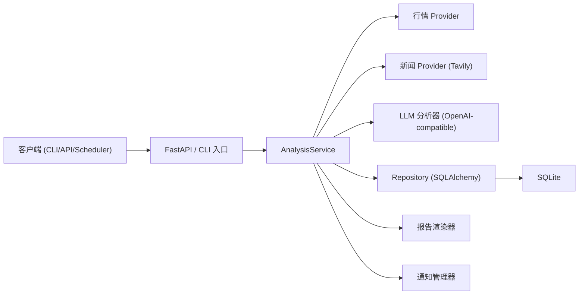

# daily_ETF_analysis


[English README](README.md)

`daily_ETF_analysis` 是一个面向 A 股 / 港股 / 美股 ETF 的生产化智能分析服务。
核心目标是稳定输出结构化结果（信号、评分、风控、可追踪 run 合约），而不是只生成一段自然语言文案。

## 目录

1. [项目简介](#项目简介)
2. [核心能力](#核心能力)
3. [架构概览](#架构概览)
4. [目录结构](#目录结构)
5. [快速开始](#快速开始)
6. [运行模式](#运行模式)
7. [配置说明](#配置说明)
8. [API 使用指南](#api-使用指南)
9. [数据库与迁移](#数据库与迁移)
10. [产物与报告](#产物与报告)
11. [可观测性与运维](#可观测性与运维)
12. [安全说明](#安全说明)
13. [开发与质量门禁](#开发与质量门禁)
14. [CI 工作流](#ci-工作流)
15. [常见问题](#常见问题)
16. [文档索引](#文档索引)
17. [许可证与免责声明](#许可证与免责声明)

## 项目简介

系统通过以下能力完成 ETF 分析闭环：

- 多行情源拉取与降级
- 新闻增强（Tavily）
- LLM 决策引擎（OpenAI-compatible）
- SQLite 持久化 run/task/report/history
- FastAPI 对外暴露标准化查询与管理接口

统一标的格式为 `<MARKET>:<CODE>`，例如：

- `CN:159659`
- `US:QQQ`
- `HK:02800`

## 核心能力

- 分析任务全生命周期追踪（`pending -> processing -> completed|failed|cancelled`）
- ETF / 指数映射管理与跨市场对比
- 行情源优先级与回退：
  - `efinance -> akshare -> tushare/pytdx -> baostock -> yfinance`
- Provider 韧性机制：重试、退避、熔断 + 健康状态 API
- 结构化策略输出字段：
  - `score`、`trend`、`action`、`confidence`、`risk_alerts`、`summary`、`key_points`、`horizon`、`rationale`
- 历史信号检索与 run 追溯
- 回测接口（run 级 + symbol 级绩效）
- 系统配置中心（读取/校验/更新/schema/audit）
- 生命周期清理（任务/报告/行情数据留存）
- 多渠道通知（飞书/企业微信/Telegram/Email）
- Prometheus 文本指标接口（`/api/metrics`）

## 架构概览



分层边界：

- `api`：HTTP 路由、鉴权、请求/响应契约
- `services`：业务编排与流程控制
- `repositories`：持久化访问和 schema 保护
- `domain`：领域模型与规则（纯业务）

## 目录结构

```text
src/daily_etf_analysis/
├── api/                # FastAPI app、auth、v1 路由与 schema
├── backtest/           # 回测引擎与模型
├── cli/                # 命令行入口
├── config/             # Pydantic Settings 与配置校验
├── core/               # 交易日历与时间工具
├── domain/             # ETF 领域模型与 symbol 规范
├── llm/                # LLM 决策引擎
├── notifications/      # 多渠道通知 + Markdown 转图
├── observability/      # metrics 与日志
├── pipelines/          # 日报流程编排
├── providers/          # 行情与新闻 Provider
├── repositories/       # 数据库访问 + schema guard
├── reports/            # Markdown 报告渲染
└── scheduler/          # 定时调度器

scripts/                # 运维与维护脚本
docs/operations/        # 运行手册（phase3/phase4）
examples/               # 示例
tests/                  # 单测/集成/契约测试
```

## 快速开始

### 1. 环境要求

- Python `>=3.11`
- [uv](https://docs.astral.sh/uv/)
- 能访问你配置的行情/LLM/新闻服务

### 2. 安装依赖

```bash
uv sync --all-extras
```

### 3. 初始化环境变量

```bash
cp .env.example .env
```

### 4. 最小配置

即使只设置下列配置，也可以先跑通基础流程（默认值已提供）：

```env
ETF_LIST=CN:159659,US:QQQ,HK:02800
DATABASE_URL=sqlite:///./data/daily_etf_analysis.db
```

建议补齐 LLM 与新闻配置获得高质量结果：

```env
OPENAI_MODEL=gpt-4o-mini
OPENAI_API_KEY=sk-xxxx
# OPENAI_BASE_URL=https://api.openai.com
TAVILY_API_KEYS=tvly-xxxx
# TAVILY_BASE_URL=https://tavily.ivanli.cc/api/tavily
```

### 5. 启动 API

```bash
uv run uvicorn daily_etf_analysis.api.app:app --host 0.0.0.0 --port 8000
```

### 6. 健康检查

```bash
curl http://127.0.0.1:8000/api/health
curl http://127.0.0.1:8000/api/metrics
```

### 7. 发起一次分析任务

```bash
curl -X POST http://127.0.0.1:8000/api/v1/analysis/runs \
  -H "Content-Type: application/json" \
  -d '{"symbols":["CN:159659","US:QQQ","HK:02800"]}'
```

OpenAPI 文档：

- `http://127.0.0.1:8000/docs`
- `http://127.0.0.1:8000/redoc`

## 运行模式

### 仅 API 服务

```bash
uv run uvicorn daily_etf_analysis.api.app:app --host 0.0.0.0 --port 8000
```

### 单次日报执行（CLI）

```bash
uv run python scripts/run_daily_analysis.py
```

常用参数：

```bash
uv run python scripts/run_daily_analysis.py --force-run --market cn
uv run python scripts/run_daily_analysis.py --symbols CN:159659,US:QQQ --skip-notify
uv run python scripts/run_daily_analysis.py --wait-timeout-seconds 900 --poll-interval-seconds 2
```

### 主入口 `main.py`

```bash
# API + 调度（取决于配置）
uv run python main.py --serve --schedule

# 只启动 API
uv run python main.py --serve-only

# 只做市场复盘
uv run python main.py --market-review --no-notify
```

### 独立调度进程

```bash
uv run python scripts/run_scheduler.py
```

说明：

- cron 表达式格式为 6 段：`秒 分 时 日 月 周`
- `scripts/run_scheduler.py` 当前按设计仅执行 CN 市场任务

## 配置说明

配置由 `pydantic-settings` 统一加载，优先级如下：

1. 系统环境变量
2. `.env`
3. 代码默认值

### 关键配置分组

- 标的与映射
  - `ETF_LIST`、`INDEX_PROXY_MAP`、`MARKETS_ENABLED`
- 行情源与容灾参数
  - `REALTIME_SOURCE_PRIORITY`
  - `PROVIDER_MAX_RETRIES`、`PROVIDER_BACKOFF_MS`、`PROVIDER_CIRCUIT_FAIL_THRESHOLD`、`PROVIDER_CIRCUIT_RESET_SECONDS`
- LLM（仅 OpenAI-compatible）
  - `OPENAI_MODEL`, `OPENAI_API_KEY(S)`, `OPENAI_BASE_URL`
- 新闻
  - `TAVILY_API_KEYS`、`TAVILY_BASE_URL`、`NEWS_MAX_AGE_DAYS`、`NEWS_PROVIDER_PRIORITY`
- 通知
  - `NOTIFY_CHANNELS`、`FEISHU_WEBHOOK_URL`、`WECHAT_WEBHOOK_URL`、`TELEGRAM_*`、`EMAIL_*`
- 运行可靠性
  - `TASK_MAX_CONCURRENCY`、`TASK_TIMEOUT_SECONDS`
- 留存清理
  - `RETENTION_TASK_DAYS`、`RETENTION_REPORT_DAYS`、`RETENTION_QUOTE_DAYS`
- API 鉴权
  - `API_AUTH_ENABLED`、`API_ADMIN_TOKEN`
- 调度
  - `SCHEDULE_ENABLED`、`SCHEDULE_CRON_CN/HK/US`

### 鉴权行为

当 `API_AUTH_ENABLED=true`：

- 所有 `/api/v1/*` 端点都需要 `Authorization: Bearer <API_ADMIN_TOKEN>`
- `/api/health` 与 `/api/metrics` 保持公开

当 `API_AUTH_ENABLED=false`（默认）：

- `/api/v1/*` 无需 token

## API 使用指南

### 推荐调用流程

1. 创建 run

```bash
curl -X POST http://127.0.0.1:8000/api/v1/analysis/runs \
  -H "Content-Type: application/json" \
  -d '{"symbols":["US:QQQ"],"force_refresh":false}'
```

2. 查询 run 状态

```bash
curl http://127.0.0.1:8000/api/v1/analysis/runs/<run_id>
```

3. 拉取日报契约

```bash
curl "http://127.0.0.1:8000/api/v1/reports/daily?date=2026-03-10&market=all&run_id=<run_id>"
```

4. 拉取历史信号

```bash
curl "http://127.0.0.1:8000/api/v1/history/signals?symbol=US:QQQ&run_id=<run_id>"
```

### 端点清单

- 分析流程
  - `POST /api/v1/analysis/runs`
  - `GET /api/v1/analysis/runs/{run_id}`
- 报告与历史
  - `GET /api/v1/reports/daily`
  - `GET /api/v1/history/signals`
- ETF 与指数映射
  - `GET /api/v1/etfs`
  - `PUT /api/v1/etfs`
  - `GET /api/v1/index-mappings`
  - `PUT /api/v1/index-mappings`
  - `GET /api/v1/etfs/{symbol}/quote`
  - `GET /api/v1/etfs/{symbol}/history`
  - `GET /api/v1/index-comparisons`
- 回测
  - `POST /api/v1/backtest/run`
  - `GET /api/v1/backtest/results`
  - `GET /api/v1/backtest/performance`
  - `GET /api/v1/backtest/performance/{symbol}`
- 系统与运维
  - `GET /api/v1/system/provider-health`
  - `GET /api/v1/system/config`
  - `POST /api/v1/system/config/validate`
  - `PUT /api/v1/system/config`
  - `GET /api/v1/system/config/schema`
  - `GET /api/v1/system/config/audit`
  - `POST /api/v1/system/lifecycle/cleanup`
- 公共端点
  - `GET /api/health`
  - `GET /api/metrics`

## 数据库与迁移

默认数据库：

- `DATABASE_URL=sqlite:///./data/daily_etf_analysis.db`

迁移命令：

```bash
# 升级到最新
uv run alembic upgrade head

# 回滚到指定 revision（示例）
uv run alembic downgrade 20260310_0002
```

安全升级脚本（自动备份 + 迁移后校验）：

```bash
uv run python scripts/db_upgrade.py --backup-dir data/backups
```

备份 / 恢复 / 演练：

```bash
uv run python scripts/backup_db.py --output-dir backups
uv run python scripts/restore_db.py --backup-file backups/<backup>.db
uv run python scripts/drill_recovery.py --backup-dir backups
```

## 产物与报告

单次日报运行后会产出：

- `reports/daily_etf_<date>_<taskid8>.json`
- `reports/report_YYYYMMDD_<taskid8>.md`
- `reports/report_YYYYMMDD.md`（兼容路径，最新覆盖）

CLI 标准输出为结构化 JSON，包含：

- task/run 标识
- 汇总状态
- 报告路径
- 决策质量信息
- 失败信息
- 多通知渠道发送结果

## 可观测性与运维

### 配置与连通性检查

```bash
uv run python scripts/test_env.py --config
uv run python scripts/test_env.py --fetch --symbol CN:159659
uv run python scripts/test_env.py --llm
```

### 每日自检

```bash
uv run python scripts/daily_self_check.py
```

### 安全基线扫描

```bash
uv run python scripts/security_scan.py
```

### Runbook

- Phase 3：`docs/operations/phase3-runbook.md`
- Phase 4：`docs/operations/phase4-runbook.md`

## 安全说明

- `.env` 仅本地使用，禁止提交真实密钥。
- 建议在测试/生产环境启用 API Token 鉴权：

```env
API_AUTH_ENABLED=true
API_ADMIN_TOKEN=<强随机密钥>
```

- 通知发送采用 fail-soft：
  - 缺失配置会标记 `disabled`
  - 单渠道失败不会阻断其他渠道

## 开发与质量门禁

### 必跑检查

```bash
uv run ruff check src tests scripts
uv run ruff format --check src tests scripts
uv run mypy src
uv run pytest
```

前端检查（仅 `frontend/` 存在时执行）：

```bash
npm --prefix frontend run lint
npm --prefix frontend run typecheck
npm --prefix frontend run test
npm --prefix frontend run build
```

### 常用开发命令

```bash
python scripts/setup_pre_commit.py
uv run pytest tests/test_api_v1.py
uv run pytest tests/test_end_to_end_analysis_flow.py
```

## CI 工作流

- `.github/workflows/daily_etf_analysis.yml`：每日分析（定时 + 手动）
- `.github/workflows/quality_gate.yml`：质量门禁（lint/type/test）
- `.github/workflows/release_guard.yml`：发布守卫与回滚检查

## 常见问题

### 1. 提示 `No LLM configured`

配置以下任意一种：

- `OPENAI_MODEL`
- `OPENAI_API_KEY` / `OPENAI_API_KEYS`

### 2. `/api/v1/*` 返回 `401/403`

- 检查 `API_AUTH_ENABLED` 是否开启
- 若开启，必须携带 `Authorization: Bearer <API_ADMIN_TOKEN>`

### 3. 报告内容为空或质量差

- 查看 Provider 健康：`GET /api/v1/system/provider-health`
- 检查 Tavily key 与 `NEWS_MAX_AGE_DAYS`
- 检查 OpenAI 模型/密钥配置

### 4. 定时任务不触发

- 确认 `SCHEDULE_ENABLED=true`
- 确认 cron 为 6 段格式（秒 分 时 日 月 周）
- 确认当前市场交易日且已过收盘时间

### 5. `security_scan.py` 报 pip-audit 错误

- 先安装 `pip-audit` 后重试

## 文档索引

- [配置指南](doc/SETTINGS_GUIDE.md)
- [SDK 使用说明](doc/SDK_USAGE.md)
- [Pre-commit 指南](doc/PRE_COMMIT_GUIDE.md)
- [模型指南](doc/MODELS_GUIDE.md)
- [架构分析报告](docs/PROJECT_ARCHITECTURE_LLM_REPORT.md)
- [Phase 3 运维手册](docs/operations/phase3-runbook.md)
- [Phase 4 运维手册](docs/operations/phase4-runbook.md)

## 许可证与免责声明

- 许可证：[MIT](LICENSE)
- 本项目仅供研究与工程实践，不构成任何投资建议。
