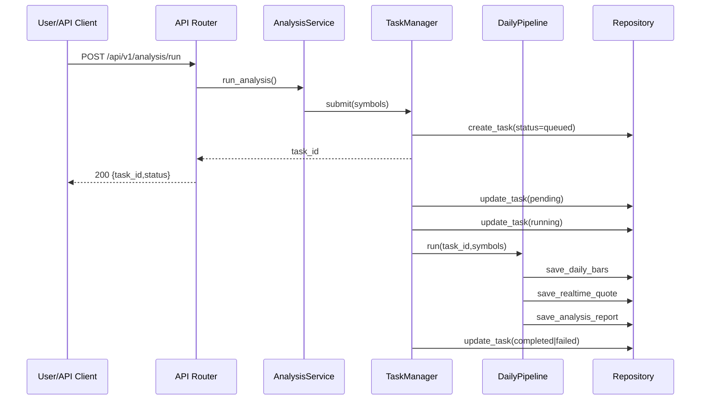
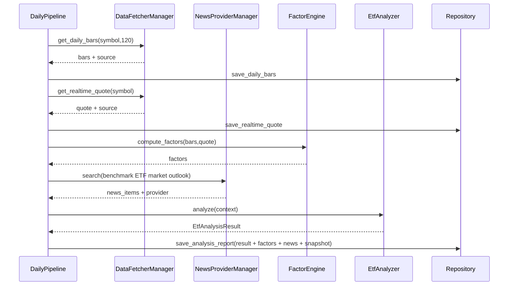
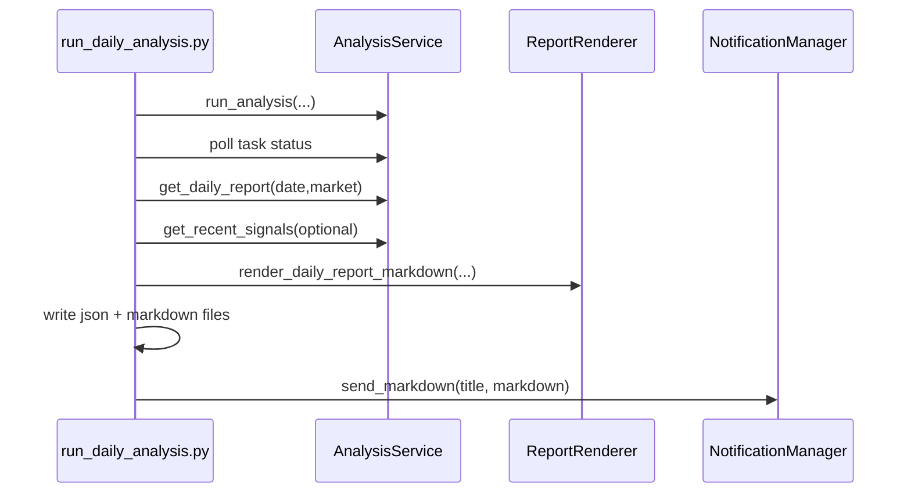
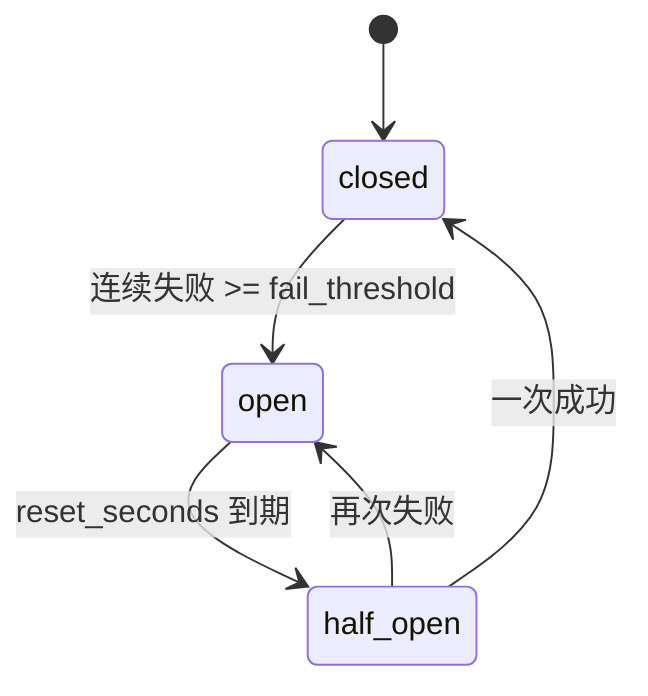
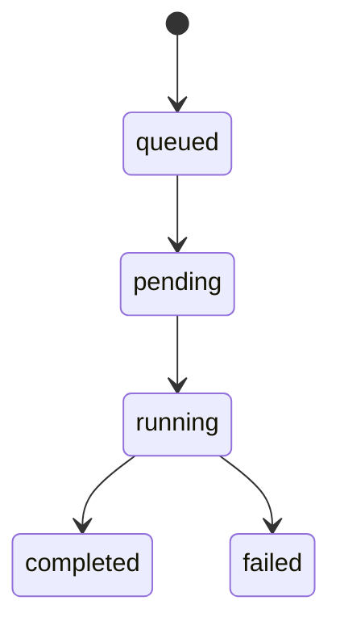

# daily_ETF_analysis 架构与 LLM 深度技术报告

- 报告版本：v2（扩展详细版）
- 生成日期：2026-03-10
- 仓库：`/Users/simonsun/github_project/daily_ETF_analysis`
- 面向读者：项目维护者、后续开发者、运维值班人员、算法/LLM 协作者

---

## 目录

1. 项目定位与目标边界
2. 代码仓库结构与模块地图
3. 系统分层架构（逻辑视图）
4. 运行时拓扑（进程与组件）
5. 关键执行链路（端到端时序）
6. 配置系统（Settings）与动态治理
7. 数据采集层：多源行情 + 新闻增强
8. 可靠性机制：重试、退避、熔断、背压
9. LLM 子系统：参与方式、协议、回退
10. 领域模型与任务状态机
11. 数据持久化模型（数据库与迁移）
12. API 契约全景（鉴权、错误码、读写边界）
13. 报告生成与通知分发体系
14. 调度系统（多市场多时区）
15. 可观测性体系（metrics + provider health）
16. 回测链路（run-level + symbol-level）
17. 运维与安全基线（脚本、Runbook、CI/CD）
18. 测试覆盖地图与质量门禁
19. 当前架构优点与风险评估
20. 演进建议（P0/P1/P2）

---

## 1. 项目定位与目标边界

## 1.1 产品定位

`daily_ETF_analysis` 是一个针对 `CN/HK/US` 大盘 ETF 的自动化分析系统。

核心价值不是“写一段分析话术”，而是“稳定生产可计算、可存储、可回测、可追溯的结构化结论”。

核心结构化字段包括：

- `score`（0-100）
- `trend`（bullish/neutral/bearish）
- `action`（buy/hold/sell）
- `confidence`（low/medium/high）
- `risk_alerts`
- `summary`
- `key_points`
- `model_used`
- `success` / `error_message`

## 1.2 支持市场与标的规范

统一 symbol 规范：`<MARKET>:<CODE>`。

- CN：`CN:159659`
- HK：`HK:02800`
- US：`US:QQQ`
- 指数代理：`INDEX:NDX`

## 1.3 当前能力边界

In Scope：

- 分析任务管理
- ETF 列表与指数映射管理
- 行情/新闻采集
- LLM 决策
- 报告输出与通知
- 历史追溯
- 回测
- 系统配置中心
- 生命周期清理
- 调度与运维脚本

Out of Scope：

- 前端 UI
- 多 Agent 协作执行框架
- 复杂策略 DSL

---

## 2. 代码仓库结构与模块地图

主代码目录：`src/daily_etf_analysis/`

| 目录 | 主要职责 |
|---|---|
| `api/` | FastAPI 应用与路由契约 |
| `config/` | 统一配置解析与校验 |
| `core/` | 时间、交易日历等基础能力 |
| `domain/` | 领域枚举、实体、symbol 规范 |
| `providers/` | 外部数据源适配（行情、新闻）+ 容错封装 |
| `llm/` | ETF LLM 分析器（Router + fallback + parser） |
| `pipelines/` | 日度分析主流水线 |
| `services/` | 业务编排（analysis/backtest/config/lifecycle） |
| `repositories/` | SQLAlchemy ORM 与数据读写 |
| `reports/` | Markdown 渲染与模板回退 |
| `notifications/` | 多渠道通知分发 |
| `scheduler/` | 定时调度 |
| `observability/` | 指标与日志导出 |
| `backtest/` | 回测引擎与数据模型 |

辅助目录：

- `scripts/`：备份恢复、安全扫描、每日运行、调度启动
- `alembic/`：数据库迁移
- `tests/`：单测/契约测试
- `.github/workflows/`：质量门禁、发布护栏、每日任务
- `docs/operations/`：Runbook

---

## 3. 系统分层架构（逻辑视图）

```mermaid
graph TD
  A[入口层 Entry] --> B[API Router]
  A --> C[CLI Runner]
  A --> D[Scheduler]

  B --> E[AnalysisService]
  C --> E
  D --> E

  E --> F[TaskManager]
  F --> G[DailyPipeline]

  G --> H[DataFetcherManager]
  G --> I[NewsProviderManager]
  G --> J[FactorEngine]
  G --> K[EtfAnalyzer]
  G --> L[EtfRepository]

  E --> M[BacktestEngine]
  E --> N[SystemConfigService]
  E --> O[DataLifecycleService]

  H --> H1[Market Providers]
  I --> I1[News Providers]

  L --> P[(SQLite)]

  C --> Q[Report Renderer]
  C --> R[NotificationManager]

  B --> S[/api/metrics]
  H --> T[Provider Stats]
  I --> T
```

分层规则：

1. `api` 层做协议转换与错误码映射。
2. `services` 层做业务编排与跨模块聚合。
3. `repositories` 层只做持久化访问。
4. `providers` 层只做外部接口适配。
5. `pipeline` 是“单任务/单 symbol”主执行器。

---

## 4. 运行时拓扑（进程与组件）

当前支持三种主运行模式。

## 4.1 API 服务模式

命令示例：

```bash
uv run uvicorn daily_etf_analysis.api.app:app --host 0.0.0.0 --port 8000
```

作用：

- 提供任务触发、查询、回测、系统配置等 REST API。
- 暴露 `/api/health` 与 `/api/metrics`。

## 4.2 CLI 单次运行模式

命令示例：

```bash
uv run python scripts/run_daily_analysis.py --symbols CN:159659,US:QQQ --skip-notify
```

作用：

- 触发一次完整分析并生成报告文件。
- 可选通知分发。

## 4.3 调度常驻模式

方式 A（统一入口）：`main.py --schedule`

方式 B（调度脚本）：`scripts/run_scheduler.py`

注意：

- A 模式在回调里对 `cn/hk/us` 都可执行（按 markets 设置）。
- B 模式当前显式仅执行 `cn`，属于策略化约束。

---

## 5. 关键执行链路（端到端时序）

## 5.1 分析任务（API 触发）



## 5.2 单 symbol 分析（Pipeline 内部）



## 5.3 CLI 日报链路



---

## 6. 配置系统（Settings）与动态治理

配置类：`config/settings.py::Settings`

## 6.1 配置分组

| 分组 | 关键字段 |
|---|---|
| 基础 | `ENVIRONMENT`, `LOG_LEVEL`, `DATABASE_URL` |
| 标的与映射 | `ETF_LIST`, `INDEX_PROXY_MAP`, `INDUSTRY_MAP`, `MARKETS_ENABLED` |
| LLM | `LITELLM_CONFIG`, `LLM_CHANNELS`, legacy keys, `LLM_*` |
| 行情与容错 | `REALTIME_SOURCE_PRIORITY`, `PROVIDER_*`, `TUSHARE_TOKEN`, `PYTDX_*` |
| 新闻 | `TAVILY_API_KEYS`, `NEWS_PROVIDER_PRIORITY`, `NEWS_MAX_AGE_DAYS` |
| 任务可靠性 | `TASK_MAX_CONCURRENCY`, `TASK_QUEUE_MAX_SIZE`, `TASK_TIMEOUT_SECONDS`, `TASK_DEDUP_WINDOW_SECONDS` |
| 报告与通知 | `NOTIFY_CHANNELS`, `REPORT_*`, `MD2IMG_*`, 各渠道凭证 |
| 调度 | `SCHEDULE_ENABLED`, `SCHEDULE_CRON_CN/HK/US` |
| 安全 | `API_AUTH_ENABLED`, `API_ADMIN_TOKEN` |
| 生命周期 | `RETENTION_TASK_DAYS`, `RETENTION_REPORT_DAYS`, `RETENTION_QUOTE_DAYS` |
| 可观测 | `METRICS_ENABLED` |

## 6.2 解析与校验特性

1. `CsvList = Annotated[list[str], NoDecode]`，支持 CSV 与 JSON 数组输入。
2. 多个 field validator 统一处理 list/json 映射。
3. `model_validator` 中执行后置归一化：
   - 归并 single key -> keys list
   - 构建 `llm_model_list`
   - 推断主模型与 fallback 列表

## 6.3 LLM 配置优先级

解析顺序：

1. `LITELLM_CONFIG`（YAML `model_list`）
2. `LLM_CHANNELS`（按渠道环境变量生成 model_list）
3. legacy keys（OpenAI/Gemini/Anthropic/DeepSeek）

## 6.4 运行时配置治理

`SystemConfigService` 提供：

- 读取当前配置快照
- 校验更新合法性
- optimistic lock 版本校验
- 落库快照 + 审计日志
- 失败回滚（删除新快照 + 记录 rollback 审计）

---

## 7. 数据采集层：多源行情 + 新闻增强

## 7.1 行情 Provider 能力矩阵

| Provider | 支持市场 | 日线 | 实时 | 备注 |
|---|---|---|---|---|
| `efinance` | CN/HK | 是 | 是 | 读取中文列名，字段映射完整 |
| `akshare` | CN/HK | 是 | 是 | CN 用 `fund_etf_*`，HK 用 `stock_hk_*` |
| `tushare` | CN | 是 | 否 | 需 token；实时返回 None |
| `pytdx` | CN | 是 | 是 | 需 host/port；以 market_id 区分深沪 |
| `baostock` | CN | 是 | 否 | 实时返回 None |
| `yfinance` | US/INDEX/兼容CN/HK | 是 | 是 | US 主源；支持指数 symbol 转换 |

默认优先级：

`efinance -> akshare -> tushare -> pytdx -> baostock -> yfinance`

US 特例：

- `DataFetcherManager._ordered_for_symbol()` 对 US 优先 `yfinance`。

## 7.2 新闻 Provider

当前默认新闻源为 Tavily（可扩展 provider 列表结构已就位）。

Tavily 机制：

1. 多 key 轮询。
2. 查询缓存（TTL 默认 900s）。
3. 天数过滤（`days` 参数 + published_date 截断）。

---

## 8. 可靠性机制：重试、退避、熔断、背压

## 8.1 Provider 调用可靠性（run_with_resilience）

统一封装入口：`providers/resilience.py::run_with_resilience`

流程：

1. 请求前检查 CircuitBreaker 是否允许。
2. 调用失败后记录失败计数与错误。
3. 在 `provider_max_retries` 范围内按指数退避重试。
4. 达阈值后熔断为 `open`。
5. 超过 reset 时间转 `half_open`，成功则恢复 `closed`。

## 8.2 熔断状态机



## 8.3 任务可靠性（TaskManager）

可靠性特性：

1. 双线程池：任务执行池 + pipeline 执行池。
2. 队列上限：`task_max_concurrency + task_queue_max_size`。
3. 去重窗口：同 symbol 在窗口内重复提交会拦截。
4. 超时控制：pipeline future 超时后任务转 failed。
5. 状态上报：queued/pending/running/completed/failed 均打点。

任务状态转移：



---

## 9. LLM 子系统：参与方式、协议、回退

模块：`llm/etf_analyzer.py`

## 9.1 LLM 在业务中的角色定位

LLM 在该项目里是“决策引擎”，而不仅是文案层。

输入：

- 因子数据（趋势、动量、波动、回撤、量能等）
- 最新报价与 bar
- 新闻摘要
- symbol/market/index 基础信息

输出：

- 结构化决策 JSON

## 9.2 输出协议（Pydantic 模型）

`_LlmResultModel`：

- `score: int(0-100)`
- `trend: str`
- `action: str`
- `confidence: str`
- `risk_alerts: list[str]`
- `summary: str`
- `key_points: list[str]`

最终映射到 `EtfAnalysisResult`，并强制转换为枚举：

- `Trend`
- `Action`
- `Confidence`

## 9.3 模型候选与调用顺序

候选模型来源：

1. `litellm_model`
2. `litellm_fallback_models`
3. 若以上为空，再从 `llm_model_list` 去重提取

调用策略：

- 逐模型尝试，失败继续下一模型。
- 每次调用统一参数：`temperature/max_tokens/timeout`。
- 有 Router 时走 `Router.completion`；否则走 `litellm.completion`。

## 9.4 输出解析与修复

解析链路：

1. 清理 markdown fence。
2. `json_repair.repair_json` 修复不标准 JSON。
3. 字符串二次 `json.loads`。
4. Pydantic validate。

任何一步失败，回落中性结果。

## 9.5 失败降级语义（neutral fallback）

默认降级值：

- `score = 50`
- `trend = neutral`
- `action = hold`
- `confidence = low`
- `success = false`
- `summary = "LLM analysis unavailable; using neutral fallback."`

## 9.6 LLM 相关风险与控制点

主要风险：

1. JSON 格式漂移。
2. 行为漂移导致 action 不稳定。
3. 模型 API 波动或超时。

已实现控制：

1. 严格 JSON 协议 + schema 验证。
2. 多模型 fallback。
3. 中性降级兜底。
4. `model_used/success/error_message` 全量落库用于审计。

---

## 10. 领域模型与任务状态机

## 10.1 关键领域实体

`domain/models.py` 包含：

- `EtfInstrument`
- `EtfDailyBar`
- `EtfRealtimeQuote`
- `EtfAnalysisContext`
- `EtfAnalysisResult`
- `AnalysisTask`
- `IndexComparisonRow`
- `IndexComparisonResult`

## 10.2 关键枚举

`domain/enums.py`：

- `Market`: CN/HK/US/INDEX
- `Trend`: bullish/neutral/bearish
- `Action`: buy/hold/sell
- `Confidence`: low/medium/high
- `TaskStatus`: queued/pending/running/completed/failed

## 10.3 symbol 规范化规则

`domain/symbols.py`：

1. 已含 market 前缀则校验并标准化。
2. 无前缀时自动推断 market：
   - 6 位数字 -> CN
   - 5 位数字 -> HK
   - 美股 ticker 正则 -> US
   - 预置指数代码 -> INDEX

---

## 11. 数据持久化模型（数据库与迁移）

Repository：`repositories/repository.py`

## 11.1 表与用途概览

| 表 | 作用 | 关键字段 |
|---|---|---|
| `etf_instruments` | 监控 ETF 主数据 | symbol, market, code, benchmark_index |
| `index_proxy_mappings` | 指数-ETF 映射 | index_symbol, proxy_symbol, priority |
| `etf_daily_bars` | 日线行情 | symbol, trade_date, OHLCV, source |
| `etf_realtime_quotes` | 实时行情 | symbol, quote_time, price, change_pct |
| `analysis_tasks` | 任务状态 | task_id, status, symbols_json, error |
| `etf_analysis_reports` | 分析结果 | task_id, symbol, trade_date, score/action/confidence + factors/news/context |
| `backtest_runs` | 回测运行摘要 | run_id, eval_window_days, hit_rate 等 |
| `backtest_results` | 回测明细 | run_id, symbol, metric fields |
| `system_config_snapshots` | 配置快照版本 | version, config_json, created_by |
| `system_config_audit_logs` | 配置审计 | version, actor, action, changes_json |

## 11.2 索引与查询优化点

已建索引（典型）：

- `etf_daily_bars.symbol`, `etf_daily_bars.trade_date`
- `etf_realtime_quotes.symbol`, `etf_realtime_quotes.quote_time`
- `analysis_tasks.status`
- `etf_analysis_reports.task_id/symbol/trade_date`
- `backtest_results.run_id/symbol/trade_date`
- `system_config_audit_logs.version`

## 11.3 迁移策略

迁移文件：

- `20260309_0001_initial.py`
- `20260310_0002_phase3_core_tables.py`

策略特征：

- 初始表 + Phase3/4 增强字段与表。
- 代码层同时有 `metadata.create_all()`，适配快速本地启动。

---

## 12. API 契约全景（鉴权、错误码、读写边界）

Router：`api/v1/router.py`

## 12.1 端点列表与鉴权

| 方法 | 路径 | 是否写操作 | require_admin_token |
|---|---|---|---|
| POST | `/api/v1/analysis/run` | 是 | 是 |
| GET | `/api/v1/analysis/tasks` | 否 | 否 |
| GET | `/api/v1/analysis/tasks/{task_id}` | 否 | 否 |
| GET | `/api/v1/history` | 否 | 否 |
| GET | `/api/v1/history/{record_id}` | 否 | 否 |
| GET | `/api/v1/history/{record_id}/news` | 否 | 否 |
| POST | `/api/v1/backtest/run` | 是 | 是 |
| GET | `/api/v1/backtest/results` | 否 | 否 |
| GET | `/api/v1/backtest/performance` | 否 | 否 |
| GET | `/api/v1/backtest/performance/{symbol}` | 否 | 否 |
| GET | `/api/v1/etfs` | 否 | 否 |
| PUT | `/api/v1/etfs` | 是 | 是 |
| GET | `/api/v1/index-mappings` | 否 | 否 |
| PUT | `/api/v1/index-mappings` | 是 | 是 |
| GET | `/api/v1/etfs/{symbol}/quote` | 否 | 否 |
| GET | `/api/v1/etfs/{symbol}/history` | 否 | 否 |
| GET | `/api/v1/reports/daily` | 否 | 否 |
| GET | `/api/v1/index-comparisons` | 否 | 否 |
| GET | `/api/v1/system/provider-health` | 否 | 否 |
| GET | `/api/v1/system/config` | 否 | 否 |
| POST | `/api/v1/system/config/validate` | 是 | 是 |
| PUT | `/api/v1/system/config` | 是 | 是 |
| GET | `/api/v1/system/config/schema` | 否 | 否 |
| GET | `/api/v1/system/config/audit` | 否 | 否 |
| POST | `/api/v1/system/lifecycle/cleanup` | 是 | 是 |

## 12.2 典型错误码约定

- 422：参数或业务校验失败
- 404：目标不存在（task/run/record 等）
- 409：版本冲突 / dedup 命中
- 429：队列满（analysis run）
- 503：服务临时不可用

---

## 13. 报告生成与通知分发体系

## 13.1 报告渲染策略

`reports/renderer.py` 支持两种模式：

1. `template` 模式（`report_markdown.j2` 存在且启用）。
2. `fallback` 模式（代码构建 Markdown）。

并包含“完整性修复”：

- 缺 score/trend/action/confidence/summary/key_points/risk_alerts 时补默认值。
- 将补洞信息写入 notes。

## 13.2 市场复盘构建

`services/market_review.py::build_market_review` 产出：

- 平均分
- trend/action 分布
- top/bottom 列表
- 风险告警聚合
- 行业维度总结（若配置 `INDUSTRY_MAP`）

## 13.3 通知中心能力矩阵

| 渠道 | markdown 发送 | 图片发送 | 启用条件 |
|---|---|---|---|
| Feishu | 是 | 否（返回 not_supported） | webhook |
| WeChat | 是 | 是 | webhook |
| Telegram | 是 | 是 | bot_token + chat_id |
| Email | 是 | 是（附件） | smtp_host + from + to |

容错策略：

1. 单渠道失败不阻断其余渠道。
2. 未配置渠道返回 `disabled`。
3. 最终返回聚合状态：`ok/failed/disabled`。

---

## 14. 调度系统（多市场多时区）

核心模块：`scheduler/scheduler.py`

## 14.1 设计要点

1. 各市场使用本地时区判断（上海/香港/纽约）。
2. cron 为 6 段格式：`sec min hour day month weekday`。
3. 每 30 秒 tick。
4. 同一分钟 marker 去重，避免重复执行。
5. 记录 next run 日志用于运维排障。

## 14.2 交易日守卫

- `core/trading_calendar.py::is_market_open_today` 使用 `exchange-calendars`（若安装）。
- 未安装时默认返回 true（更偏“不中断运行”）。

---

## 15. 可观测性体系（metrics + provider health）

## 15.1 指标端点

- 路径：`GET /api/metrics`
- 格式：Prometheus text
- 开关：`METRICS_ENABLED`

## 15.2 指标族

| 指标 | labels |
|---|---|
| `api_requests_total` | method, path, status |
| `analysis_task_total` | status |
| `provider_calls_total` | provider, operation, status |
| `notification_delivery_total` | channel, status |
| `scheduler_runs_total` | market, status |
| `report_render_total` | mode |
| `md2img_total` | channel, status |

## 15.3 Provider 健康快照

`GET /api/v1/system/provider-health` 返回：

- success_count
- failure_count
- retry_count
- circuit_state
- last_error
- last_updated

## 15.4 请求追踪

`api/app.py` middleware 为每个请求注入 `X-Request-ID`：

- 若请求头已有则沿用。
- 否则生成 uuid。
- 返回响应头时透传，便于端到端日志关联。

---

## 16. 回测链路（run-level + symbol-level）

模块：`backtest/engine.py`

## 16.1 输入

- signals：从历史分析报告提取 `symbol/trade_date/action`
- prices：从日线表提取 close 序列

## 16.2 规则口径

- `buy=+1`, `hold=0`, `sell=-1`
- `eval_window_days` 默认 20
- 无未来价格数据样本记为 skipped

## 16.3 输出

run 级：

- total/evaluated/skipped
- direction_hit_rate
- avg_return
- max_drawdown
- win_rate

symbol 级：同样字段逐 symbol 输出。

---

## 17. 运维与安全基线（脚本、Runbook、CI/CD）

## 17.1 运维脚本

| 脚本 | 功能 |
|---|---|
| `scripts/backup_db.py` | SQLite 备份（时间戳文件） |
| `scripts/restore_db.py` | 从备份恢复，并校验表数量 |
| `scripts/drill_recovery.py` | 演练恢复，输出 `rto_seconds/rpo_seconds` |
| `scripts/security_scan.py` | 依赖漏洞 + secrets pattern + policy 规则扫描 |
| `scripts/run_daily_analysis.py` | 日常运行入口 |
| `scripts/run_scheduler.py` | 调度常驻入口 |

## 17.2 Runbook

- `docs/operations/phase3-runbook.md`
- `docs/operations/phase4-runbook.md`

覆盖内容：

- 故障分级
- 诊断步骤
- 回滚恢复
- 值班清单

## 17.3 CI/CD 工作流

| workflow | 核心作用 |
|---|---|
| `quality_gate.yml` | ruff + format + mypy + pytest |
| `release_guard.yml` | 在 PR 上追加迁移探针、smoke、安全扫描 |
| `daily_etf_analysis.yml` | 工作日定时任务 + 手动参数触发 + 产物上传 |

`daily_etf_analysis.yml` 关键契约：

1. workflow_dispatch 输入：`force_run/symbols/market/skip_notify`。
2. concurrency.group 防止并发重入。
3. Config probe 只输出“是否配置”，不泄漏 secrets。
4. Smoke run 与正式 run 分步执行。
5. 上传 `reports/` 与 `logs/` 作为 artifact。

---

## 18. 测试覆盖地图与质量门禁

## 18.1 测试体量

当前 `tests/` 覆盖约 `88` 个 `test_` 用例（按静态统计）。

## 18.2 关键测试域

| 测试文件（示例） | 覆盖域 |
|---|---|
| `test_llm_analyzer.py` | LLM 解析失败回退、fallback 模型顺序 |
| `test_settings_llm_priority.py` | LLM 配置优先级（YAML > channels > legacy） |
| `test_data_fetcher_manager.py` | provider failover 行为 |
| `test_resilience.py` | retry/circuit-breaker 合同 |
| `test_task_reliability.py` | 队列背压、超时、dedup |
| `test_daily_pipeline_market_guard.py` | 交易日守卫逻辑 |
| `test_repository_phase3_schema.py` | phase3 表结构与 roundtrip |
| `test_backtest_*` | 回测引擎与 API |
| `test_system_config_*` | 配置中心 API 与版本治理 |
| `test_metrics_endpoint.py` | metrics 合同 |
| `test_daily_workflow_contracts.py` | daily workflow 契约 |
| `test_security_scan_contract.py` | 安全扫描输出契约 |

## 18.3 项目门禁命令

```bash
uv run ruff check src tests scripts
uv run ruff format --check src tests scripts
uv run mypy src
uv run pytest
```

---

## 19. 当前架构优点与风险评估

## 19.1 优点

1. 分层边界清晰，模块耦合可控。
2. 任务可靠性机制完整（背压、超时、去重）。
3. Provider 层容错与观测完备（retry + circuit + health API）。
4. LLM 输出可追溯（model_used/success/error_message/context/news）。
5. 运维闭环完整（runbook + scripts + CI workflow）。

## 19.2 风险与约束

1. LLM 直接产出 action/score，模型漂移会影响决策稳定性。
2. `AnalysisService._apply_runtime_settings()` 重建 `TaskManager` 时未显式 shutdown 旧实例，长期运行可能累积后台线程资源。
3. `main.py` 与 `scripts/run_scheduler.py` 的调度市场策略不一致，易导致“配置相同但行为不同”的认知偏差。
4. `create_all` 与 Alembic 并存，需要明确生产环境 schema 管控策略。
5. 目前新闻源默认仅 Tavily，外部依赖抖动会影响上下文质量。

---

## 20. 演进建议（P0/P1/P2）

## P0（短期稳定性，建议 1-2 周）

1. TaskManager 热更新安全化：配置变更后先优雅关闭旧 manager，再替换新实例。
2. 调度入口统一：明确一个主调度入口，并统一多市场策略。
3. 生产 schema 策略固化：生产禁用 `create_all`，仅走 Alembic。
4. LLM 输出一致性守卫：增加 score/action/trend 的规则二次校验。

## P1（中期质量提升，建议 2-4 周）

1. 引入“规则基线分 + LLM 偏置修正”双轨决策，降低模型漂移影响。
2. 增加分析结果版本化（prompt hash / model profile / feature snapshot hash）。
3. 回测结果反向归因到 `model_used`，形成模型质量闭环看板。
4. 扩展新闻源冗余（在现有 provider manager 模式下实现次级源）。

## P2（中长期演进，建议 1-2 月）

1. 引入前端观测面板（任务、provider 健康、回测走势、通知状态）。
2. 异步队列外部化（如 Redis/Celery 或消息队列）提升水平扩展能力。
3. 增加多策略实验框架（A/B 模型、不同提示模板评估）。

---

## 附录 A：关键源码入口索引

### 入口与运行

- `main.py`
- `scripts/run_daily_analysis.py`
- `scripts/run_scheduler.py`

### API 与协议

- `src/daily_etf_analysis/api/app.py`
- `src/daily_etf_analysis/api/v1/router.py`
- `src/daily_etf_analysis/api/v1/schemas.py`
- `src/daily_etf_analysis/api/auth.py`

### 服务编排

- `src/daily_etf_analysis/services/analysis_service.py`
- `src/daily_etf_analysis/services/task_manager.py`
- `src/daily_etf_analysis/services/system_config_service.py`
- `src/daily_etf_analysis/services/data_lifecycle_service.py`

### Pipeline 与 LLM

- `src/daily_etf_analysis/pipelines/daily_pipeline.py`
- `src/daily_etf_analysis/services/factor_engine.py`
- `src/daily_etf_analysis/llm/etf_analyzer.py`

### Provider 与容错

- `src/daily_etf_analysis/providers/market_data/base.py`
- `src/daily_etf_analysis/providers/market_data/*.py`
- `src/daily_etf_analysis/providers/news/manager.py`
- `src/daily_etf_analysis/providers/news/tavily_provider.py`
- `src/daily_etf_analysis/providers/resilience.py`

### 数据层

- `src/daily_etf_analysis/repositories/repository.py`
- `alembic/versions/20260309_0001_initial.py`
- `alembic/versions/20260310_0002_phase3_core_tables.py`

### 报告、通知、调度、观测

- `src/daily_etf_analysis/reports/renderer.py`
- `src/daily_etf_analysis/notifications/manager.py`
- `src/daily_etf_analysis/scheduler/scheduler.py`
- `src/daily_etf_analysis/observability/metrics.py`
- `src/daily_etf_analysis/observability/provider_stats.py`

### 回测

- `src/daily_etf_analysis/backtest/engine.py`
- `src/daily_etf_analysis/backtest/models.py`

### 运维与 CI

- `docs/operations/phase3-runbook.md`
- `docs/operations/phase4-runbook.md`
- `.github/workflows/daily_etf_analysis.yml`
- `.github/workflows/quality_gate.yml`
- `.github/workflows/release_guard.yml`

---

## 附录 B：结论（给决策者）

这不是“多 agent 执行系统”，而是“单主线编排 + 多数据源容错 + LLM 决策器”的生产化分析平台。

其成熟度已经覆盖：

1. 功能闭环（分析、回测、报告、通知）。
2. 稳定性基础（重试、熔断、背压、超时）。
3. 运维基础（指标、runbook、备份恢复、安全扫描）。
4. 工程治理（测试契约与 CI 门禁）。

下一阶段重点应从“功能补全”转向“决策稳定性与可审计性强化”，尤其是 LLM 直出 action 的治理与回测反馈闭环。
