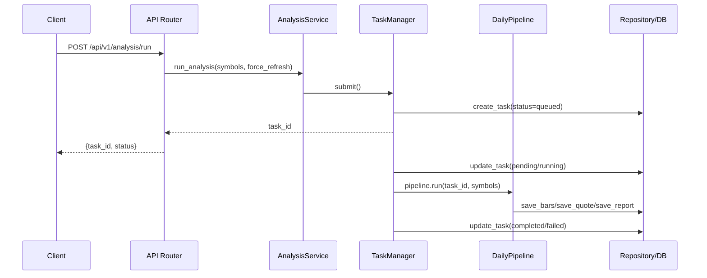

# daily_ETF_analysis 全面架构与 LLM 参与报告

- 报告日期：2026-03-10
- 仓库路径：`/Users/simonsun/github_project/daily_ETF_analysis`
- 报告范围：当前仓库代码与文档（`src/`, `scripts/`, `tests/`, `docs/`, `.github/workflows/`）

---

## 1. 执行摘要

`daily_ETF_analysis` 是一个面向 `CN/HK/US` 大盘 ETF 的分析系统，核心目标是“稳定产出结构化分析结果”，而非仅生成文案。

当前系统已形成完整闭环：

1. 多源行情采集与容错（retry/backoff/circuit-breaker）。
2. 因子计算 + 新闻增强 + LLM 决策输出。
3. 任务化异步执行（排队、并发、超时、去重）。
4. 报告生成（JSON + Markdown）与多渠道通知。
5. 历史追溯、回测、配置中心、生命周期治理。
6. API + Scheduler + CI/CD + 运维 Runbook。

从实现上看，LLM 在本项目中不是“纯文案层”，而是**直接参与信号决策**（`score/trend/action/confidence`），并通过中性降级保障可用性。

---

## 2. 项目定位与能力边界

### 2.1 业务定位

- 覆盖市场：A 股、港股、美股 ETF。
- 统一标识：`<MARKET>:<CODE>`，如 `CN:159659`、`US:QQQ`、`HK:02800`。
- 核心产出：可落库、可回测、可审计的结构化分析结果。

### 2.2 当前边界

- 有：API 服务、任务系统、报告、通知、回测、配置中心、运维脚本。
- 无：前端 UI（目前主要通过 API/脚本使用）。

---

## 3. 技术栈与工程基线

- 语言：Python 3.11+
- API：FastAPI
- 配置：Pydantic Settings
- 存储：SQLite + SQLAlchemy + Alembic
- LLM：LiteLLM Router + 多模型 fallback
- 数据源：efinance / akshare / tushare / pytdx / baostock / yfinance
- 新闻：Tavily
- 质量：ruff + mypy + pytest
- CI：GitHub Actions（quality_gate / release_guard / daily_etf_analysis）

---

## 4. 架构总览

```mermaid
graph TD
  U[用户/API调用/定时任务] --> API[FastAPI /api + /api/v1]
  U --> CLI[scripts/run_daily_analysis.py]
  U --> SCH[EtfScheduler]

  API --> SVC[AnalysisService]
  CLI --> SVC
  SCH --> SVC

  SVC --> TM[TaskManager]
  TM --> PIPE[DailyPipeline]

  PIPE --> MKT[DataFetcherManager]
  PIPE --> NEWS[NewsProviderManager]
  PIPE --> FACTOR[FactorEngine]
  PIPE --> LLM[EtfAnalyzer]
  PIPE --> REPO[EtfRepository]

  MKT --> P1[efinance/akshare/.../yfinance]
  NEWS --> P2[Tavily]

  REPO --> DB[(SQLite)]
  SVC --> BT[BacktestEngine]
  CLI --> RPT[Report Renderer]
  CLI --> NTFY[NotificationManager]

  API --> METRICS[/api/metrics]
  MKT --> OBS[Provider Stats + Metrics]
  NEWS --> OBS
```

### 4.1 分层职责

| 层 | 主要模块 | 职责 |
|---|---|---|
| 接入层 | `api/app.py`, `api/v1/router.py` | 路由、参数校验、鉴权、HTTP 错误码映射 |
| 编排层 | `services/analysis_service.py` | 用例编排、聚合 repository/pipeline/backtest/config/lifecycle |
| 任务层 | `services/task_manager.py` | 队列、并发、背压、超时、去重 |
| 流水线层 | `pipelines/daily_pipeline.py` | 单 symbol 端到端分析执行链路 |
| 数据源层 | `providers/market_data/*`, `providers/news/*` | 外部行情/新闻拉取与字段适配 |
| 决策层 | `llm/etf_analyzer.py` | Prompt 构建、模型调用、JSON 解析、降级 |
| 数据层 | `repositories/repository.py` | ORM 模型 + 持久化读写 + 聚合查询 |
| 运维层 | `scheduler/`, `notifications/`, `observability/`, `scripts/` | 调度、通知、指标、备份恢复、安全扫描 |

---

## 5. 核心执行流程

## 5.1 API 触发分析任务（`POST /api/v1/analysis/run`）



关键机制：

1. `TaskManager` 使用 in-memory 队列 + 线程池，支持并发上限。
2. 超过容量返回“queue is full”（API 映射 429/503）。
3. 去重窗口内重复 symbol 会被拦截（返回 409）。
4. 单任务超时后标记失败并写入错误。

## 5.2 Daily 批处理脚本流程（`scripts/run_daily_analysis.py`）

1. 解析参数（force-run/market/symbols/skip-notify）。
2. 调用 `AnalysisService.run_analysis` 提交任务。
3. 轮询任务状态直到完成或超时。
4. 读取当日报告数据、构建 market review/history。
5. 写出 `reports/*.json` 与 `reports/*.md`。
6. 通过 `NotificationManager` 多渠道分发。

## 5.3 Scheduler 流程

1. `EtfScheduler` 每 30 秒 tick 一次。
2. 按 `CN/HK/US` 各自时区 + cron 判断触发。
3. 同一分钟 marker 去重，避免重复触发。
4. `main.py` 的 scheduler 回调可同时覆盖多市场。
5. `scripts/run_scheduler.py` 当前显式只执行 `cn`（其余市场跳过，属于运行策略上的收敛）。

---

## 6. 数据层与存储设计

## 6.1 核心表（Repository ORM）

| 表 | 用途 |
|---|---|
| `etf_instruments` | ETF 基础信息与启用状态 |
| `index_proxy_mappings` | 指数与跨市场代理 ETF 映射 |
| `etf_daily_bars` | 日线行情（唯一键 symbol+trade_date） |
| `etf_realtime_quotes` | 实时行情快照 |
| `analysis_tasks` | 任务状态机与参数 |
| `etf_analysis_reports` | 分析结果、因子、新闻、上下文快照 |
| `backtest_runs` | 回测运行摘要 |
| `backtest_results` | 回测分 symbol 结果 |
| `system_config_snapshots` | 配置快照版本 |
| `system_config_audit_logs` | 配置变更审计 |

## 6.2 数据生命周期

- 保留策略由配置控制：
  - `RETENTION_TASK_DAYS`
  - `RETENTION_REPORT_DAYS`
  - `RETENTION_QUOTE_DAYS`
- `DataLifecycleService.cleanup(dry_run)` 支持先预览影响，再执行清理。

## 6.3 迁移策略

- 代码保留 `metadata.create_all()` 以便快速起跑。
- 同时提供 Alembic 迁移（`20260309_0001`, `20260310_0002`）用于受控 schema 演进。

---

## 7. LLM 参与机制（重点）

## 7.1 LLM 在链路中的位置

LLM 位于 `DailyPipeline` 的核心步骤中：

1. 先算因子（MA、动量、波动、回撤、量能等）。
2. 再检索相关新闻并组装上下文。
3. 再调用 `EtfAnalyzer.analyze(context)` 输出结构化决策。
4. 结果（含 `model_used`, `success`, `error_message`）落库。

这意味着 LLM 输出不是“附加文案”，而是直接影响策略字段：

- `score`
- `trend`
- `action`
- `confidence`
- `summary`
- `key_points`
- `risk_alerts`

## 7.2 LLM 配置优先级

在 `Settings` 中按以下顺序解析：

1. `LITELLM_CONFIG`（YAML model_list）
2. `LLM_CHANNELS`（渠道模式）
3. legacy keys（`OPENAI_*`, `GEMINI_*`, `ANTHROPIC_*`, `DEEPSEEK_*`）

并自动推断：

- `litellm_model`（主模型）
- `litellm_fallback_models`（回退模型序列）

## 7.3 Prompt 与输出契约

`EtfAnalyzer` 固定 system prompt，要求“仅输出 JSON”，并约束字段与枚举。

输入内容由 pipeline 构建，包含：

1. symbol/market/code/benchmark。
2. 因子 JSON（含数据质量、收益、波动等）。
3. 最近新闻摘要（最多 5 条）。

输出解析路径：

1. 去掉 markdown fence。
2. `json_repair` 修复异常 JSON。
3. Pydantic schema 校验。
4. 转换成 `EtfAnalysisResult`。

## 7.4 模型路由与失败处理

- 候选模型顺序：主模型 + fallback 列表（去重）。
- 每个模型失败会记录 warning 并尝试下一模型。
- 全失败或解析失败时，返回**中性降级结果**：
  - `score=50`
  - `trend=neutral`
  - `action=hold`
  - `confidence=low`
  - `success=false`

## 7.5 LLM 与规则引擎关系

当前实现是“**规则特征 + LLM 决策**”：

- 规则层负责特征工程（客观输入）。
- LLM 负责最终评分与行动建议（主观决策层）。

这与“仅用 LLM 写摘要”的架构相比，表达力更高，但也更依赖模型稳定性。因此你已经通过 fallback + neutral fallback 做了可靠性兜底。

---

## 8. 数据源与容错设计

## 8.1 行情 Provider 矩阵

- `efinance`：CN/HK
- `akshare`：CN/HK
- `tushare`：CN（需 token）
- `pytdx`：CN
- `baostock`：CN
- `yfinance`：US/INDEX + 兼容 CN/HK 映射

`DataFetcherManager` 支持按 `REALTIME_SOURCE_PRIORITY` 排序，且对 US 市场默认优先 `yfinance`。

## 8.2 新闻 Provider

- 当前默认 `TavilyProvider`。
- 支持 API key 轮询、TTL 缓存、发布时效过滤。

## 8.3 Resilience

统一包装 `run_with_resilience`：

1. retry（指数退避）。
2. circuit breaker（closed/open/half_open）。
3. provider 统计（成功/失败/重试/最后错误）。
4. 指标埋点（provider_calls_total）。

---

## 9. 报告与通知链路

## 9.1 报告渲染

`render_daily_report_markdown` 支持：

1. 模板渲染（Jinja2）。
2. fallback 文本渲染。
3. 完整性补洞（缺字段填默认值并记录 notes）。
4. 市场复盘（top/bottom/industry/risk）。
5. 历史信号摘要。

## 9.2 通知中心

`NotificationManager` 聚合 `feishu/wechat/telegram/email`：

1. 渠道未配置返回 `disabled`，不阻断全局。
2. 单渠道失败不影响其他渠道。
3. 支持 markdown 转图片再发送（按渠道可配置）。

---

## 10. API 能力地图

### 10.1 分析与任务

- `POST /api/v1/analysis/run`
- `GET /api/v1/analysis/tasks`
- `GET /api/v1/analysis/tasks/{task_id}`

### 10.2 行情与报告

- `GET /api/v1/etfs/{symbol}/quote`
- `GET /api/v1/etfs/{symbol}/history`
- `GET /api/v1/reports/daily`
- `GET /api/v1/index-comparisons`

### 10.3 历史与回测

- `GET /api/v1/history`
- `GET /api/v1/history/{record_id}`
- `GET /api/v1/history/{record_id}/news`
- `POST /api/v1/backtest/run`
- `GET /api/v1/backtest/results`
- `GET /api/v1/backtest/performance`
- `GET /api/v1/backtest/performance/{symbol}`

### 10.4 系统治理与运维

- `GET /api/v1/system/provider-health`
- `GET/POST/PUT /api/v1/system/config*`
- `POST /api/v1/system/lifecycle/cleanup`
- `GET /api/health`
- `GET /api/metrics`

写接口可通过 `API_AUTH_ENABLED + API_ADMIN_TOKEN` 统一开启鉴权。

---

## 11. 可观测性与运维能力

### 11.1 指标

内置计数器（Prometheus 文本格式）：

- `api_requests_total`
- `analysis_task_total`
- `provider_calls_total`
- `notification_delivery_total`
- `scheduler_runs_total`
- `report_render_total`
- `md2img_total`

### 11.2 运维脚本

- `scripts/backup_db.py`：数据库备份
- `scripts/restore_db.py`：恢复
- `scripts/drill_recovery.py`：恢复演练（RTO/RPO）
- `scripts/security_scan.py`：依赖漏洞/密钥泄漏/策略检查

### 11.3 CI/CD

- `quality_gate.yml`：lint/format/mypy/pytest
- `release_guard.yml`：迁移探针 + smoke + 安全扫描
- `daily_etf_analysis.yml`：定时与手动每日分析，上传 `reports/` 与 `logs/`

---

## 12. 测试与质量现状

- 当前测试文件：30+（`tests/`）
- 测试用例总数：约 `88`（按 `rg "def test_"` 统计）
- 覆盖主题：
  - LLM 解析与 fallback
  - provider failover/resilience
  - task queue/backpressure/timeout/dedup
  - history/backtest/config/lifecycle API
  - metrics、workflow 合同、runbook 链路

整体上，测试已经从“功能正确”拓展到“运维契约正确”。

---

## 13. 当前架构优点与主要风险

## 13.1 优点

1. 分层清晰：API/Service/Repo/Provider 边界明确。
2. 容错到位：多源 fallback + 熔断 + 统一指标。
3. 任务可靠：并发、队列、超时、去重全具备。
4. 运维闭环：指标、runbook、备份恢复、安全扫描齐全。
5. 可追溯：analysis report 中保存 context/news/model_used。

## 13.2 主要风险与改进方向

1. **LLM 决策耦合较高**：当前 action/score 直接由 LLM 生成，建议逐步引入“规则底线 + LLM 校正”双轨策略，降低模型漂移影响。
2. **System Config 热更新后 TaskManager 复建**：`_apply_runtime_settings` 会重建 `TaskManager`，建议显式关闭旧 manager，避免长期运行下线程资源累积风险。
3. **调度入口策略不一致**：`main.py` 与 `scripts/run_scheduler.py` 对多市场处理策略不同（后者仅 CN），建议统一运行约定并在 README 标注。
4. **create_all 与 Alembic 双机制并存**：开发便捷但需在生产明确“仅迁移管理”策略，避免 schema 漂移。

---

## 14. 针对 LLM 能力的下一步建议

1. 增加“信号解释字段”结构化输出（例如 `factor_contributions`），提升可审计性。
2. 在 `etf_analysis_reports` 中追加 prompt 摘要哈希，便于回溯同日多次运行差异来源。
3. 为 LLM 输出增加二次校验规则（如 action 与 score 一致性检查）。
4. 建立“模型质量回看”任务：将回测表现反向关联到 `model_used`，形成模型选型数据闭环。

---

## 15. 关键代码索引（便于继续阅读）

- 入口与执行：
  - `main.py`
  - `src/daily_etf_analysis/cli/run_daily_analysis.py`
- API：
  - `src/daily_etf_analysis/api/app.py`
  - `src/daily_etf_analysis/api/v1/router.py`
  - `src/daily_etf_analysis/api/v1/schemas.py`
- 核心编排：
  - `src/daily_etf_analysis/services/analysis_service.py`
  - `src/daily_etf_analysis/services/task_manager.py`
  - `src/daily_etf_analysis/pipelines/daily_pipeline.py`
- LLM：
  - `src/daily_etf_analysis/llm/etf_analyzer.py`
  - `src/daily_etf_analysis/config/settings.py`
- 数据与存储：
  - `src/daily_etf_analysis/repositories/repository.py`
  - `alembic/versions/20260309_0001_initial.py`
  - `alembic/versions/20260310_0002_phase3_core_tables.py`
- 运维与可靠性：
  - `src/daily_etf_analysis/providers/resilience.py`
  - `src/daily_etf_analysis/observability/metrics.py`
  - `src/daily_etf_analysis/notifications/manager.py`
  - `docs/operations/phase3-runbook.md`
  - `docs/operations/phase4-runbook.md`

---

如果你希望，我可以在这份报告基础上再生成一个“**架构改造建议版**”（按优先级拆成 `P0/P1/P2` 任务清单 + 预估改造工作量），直接可作为下一阶段开发计划输入。
